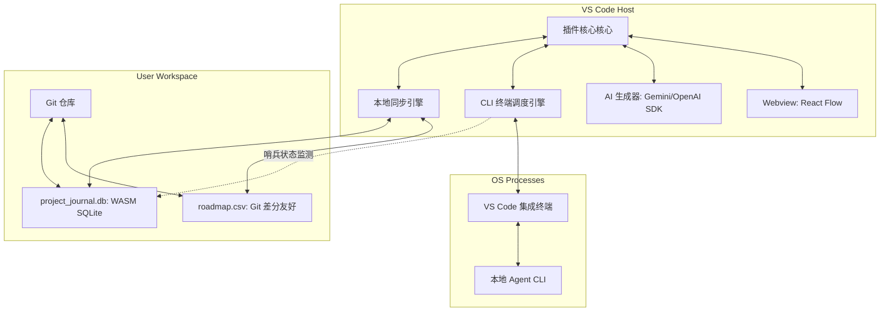

  

<h1 align="center">🎯 Solopreneur AI Roadmap</h1>

  <strong>独立开发者与一人公司的全生命周期 AI 导航仪 ＆ 智能体编排引擎</strong>

  
  
  

---

## 💡 为什么选择 Solopreneur AI Roadmap？

对于**独立开发者（Solopreneurs）**与**一人公司**而言，最奢侈的资源就是**时间与执行焦距**。我们常常在海量的任务中迷失方向，或者在调用各种繁琐的 AI 智能体时感到流程支离破碎。

**Solopreneur AI Roadmap** 彻底改变了这一切。它是一个直接嵌入您 VS Code 侧边栏的交互式项目生命周期导航面板。只需输入您的产品创意，AI 便会瞬间为您规划出清晰的里程碑图谱。更重要的是，您可以直接指派本地安装的 AI 智能体 CLI，让它们在 VS Code 集成终端中为您攻坚克难，自动推进项目状态。

---

## ✨ 核心亮点

### 🎨 1. Cofounder2 级极客视觉美学
*   **玻璃拟态面板**：采用最前沿的毛玻璃微透卡片视觉（`backdrop-filter: blur(10px)`），全局适配 VS Code 原生配色。
*   **状态呼吸流光**：节点状态一目了然：
    *   `Pending (等待)`：精致优雅的极简白灰边框。
    *   `Running (执行中)`：炫酷的**青蓝霓虹流光发光与呼吸阴影**。
    *   `Completed (已完成)`：带成功勾选标记的翡翠绿光环。
    *   `Failed (失败)`：警示度极高的霓虹红霓虹边缘。
*   **光流连接连线**：连接节点的 SVG 路径具有流光传送微交互动效，直观呈现项目里程碑的演进轨迹。

### 💾 2. 完美的 Git 友好双轨存储 (CSV + SQLite)
*   **纯文本 CSV 真实源** (`roadmap.csv`)：项目节点、依赖与执行状态保存在极简的文本 CSV 文件中。每当项目产生阶段性进展，`git diff` 会呈现单行级文本变更，**彻底规避二进制合并冲突**，天然便于版本控制。
*   **WASM SQLite 高性能日志库** (`project_journal.db`)：使用 `sql.js` WASM 运行层，零 C++ 编译负担。自动在本地存储详细的 Agent 控制台交互日志、AI 提示词历史及执行性能，保障高频关系检索。

### 🤖 3. 终端智能体编排 (File Sentinel IPC)
*   **集成终端无缝交互**：点击 `⚡ Run Agent` 直接唤起侧边交互终端，自动匹配执行本地智能体（如 `antigravity-cli`, `cursor-cli`, `gitops-cli` 等）。
*   **文件哨兵异步互通**：使用轻量级的 `.agent_status.json` 文件作为进程通讯媒介，插件的原生文件系统监视器自动捕获智能体运行成果，自动将路线图推进至下一节点。

---

## 🛠️ 极客架构全景

---

## 🚀 快速激活与使用指引

### 1. 启动路线图
1. 打开您的任意项目文件夹。
2. 按下快捷键 `Ctrl + Shift + P`（macOS 上为 `Cmd + Shift + P`）唤起命令面板。
3. 输入并运行命令：**`Solopreneur: Show AI Roadmap`**。
4. 侧边栏及主视图将立刻为您载入一个精致的 6 阶段初始化路线图！

### 2. 用 AI 生成定制项目图谱
1. 在顶部输入框中键入您的业务创意（例如：“*开发一个带暗黑模式和 GitHub 登录的 Markdown 博客*”）。
2. 点击 **Generate AI Roadmap (AI 生成路线图)**。
3. 进度气泡自动显示，数秒内 AI 就会为您动态生成一套定制的任务里程碑有向无环图 (DAG)！

### 3. 一键指派本地智能体
1. 选择任意任务卡片，查看对应的 Agent 指令与 CLI。
2. 点击 **`⚡ Run Agent`**，内置终端将自动浮现并开始执行 AI 生成的具体代码或文档任务。
3. 节点将伴随青蓝发光显示为 `Running`。当终端运行结束，节点将自动闪烁呼吸翡翠绿并标记为 `Completed`，全自动流转！

---

## 🔒 隐私与安全性

*   **100% 本地优先**：除了您的 AI 生成请求（如使用 Gemini 官方接口）外，您的所有项目结构、任务描述、数据库及智能体输出日志**全部保留在您的本地电脑中**，绝不上传至任何第三方云端。您的代码与商业秘密绝对安全。
*   **透明执行**：所有本地智能体指令均在 VS Code 内置终端中可视化公开运行，绝不在后台暗中执行，让您拥有完全的主权与掌控度。

---

## 🤝 贡献与反馈

本插件由 **SZLK** 精心打造。如果您在使用过程中有任何反馈、功能建议或发现了 Bug，非常欢迎访问我们的 [GitHub 仓库](https://github.com/jobssteve164dev/solopreneur-roadmap) 提交 Issue 或 Pull Request！

*   **项目官网**: [jobssteve164dev/solopreneur-roadmap](https://github.com/jobssteve164dev/solopreneur-roadmap)
*   **许可协议**: [MIT License](https://github.com/jobssteve164dev/solopreneur-roadmap/blob/main/LICENSE)
