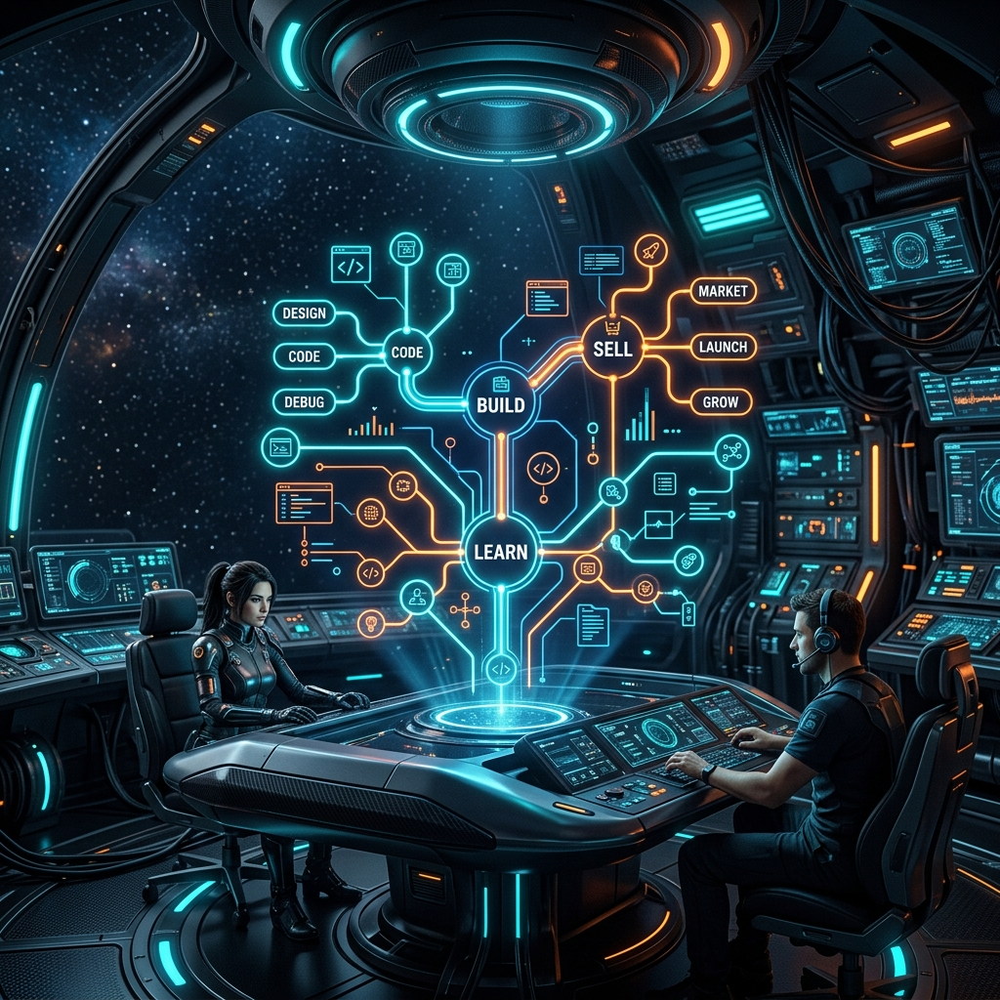

# 🎬 SoloMap B站视频封面设计与文案方案

本项目（SoloMap）是一个基于 VS Code 的**本地 AI Agent 驾驶舱与可视化路线图助手**。针对 B 站（哔哩哔哩）的程序员、独立开发者和 AI 探索者群体，封面设计需要一眼击中**“AI 乱聊地狱导致项目烂尾”**的痛点，或展现**“一人用 AI 军团高效交付”**的爽点。

---

## 🌌 封面背景视觉 (Background Visual)

我们已为您生成了一张高科技、极具未来感的“AI 编码驾驶舱” 16:9 背景图。它完美隐喻了 SoloMap 的核心心智：**可视化路线图（Build ➔ Sell ➔ Learn ➔ Improve）与智能体集中调度**。

> [!TIP]
> **画面心智暗示**：中间发光的 holographic 树状路线图暗示着清晰的商业闭环推进；两侧操作台的开发者象征着独立创始人（Solopreneur）在 VS Code 中对多个本地 Agent 的全局掌控。

---

## ✍️ 观众心智文案方案 (High-Converting Copy Options)

以下针对不同受众侧重，为您定制了三套文案。大字标题应采用**粗壮、醒目、高对比度**的字体（如黄/白配，加黑边或投影）。

### 方案 A：直击痛点型（推荐，针对“乱聊地狱”）
*   **核心痛点**：很多开发者用 Cursor/Claude-Code 开了十几个 Chat 窗口，最后根本不知道代码改了哪、下一步该干嘛。
*   **主标题（超大字）**：
    # **AI写代码 越写越乱？**
*   **副标题（中字）**：
    > **别在20个Chat窗口里捉迷藏了！你需要这个 VS Code 驾驶舱**
*   **心智钩子**：利用焦虑与共鸣，“越写越乱”是所有用过 AI 编程的人的共同痛点。

### 方案 B：爽感与野心型（针对“独立开发者”）
*   **核心爽点**：用可视化路线图一键调度多个本地智能体，一个人干完一个团队的活。
*   **主标题（超大字）**：
    # **1人做项目，怎么指挥AI军团？**
*   **副标题（中字）**：
    > **可视化 AI 编码路线图，让 VS Code 变成你的“作战指挥部”**
*   **心智钩子**：激起独立开发者掌控全局、做“一人公司”的成就感。

### 方案 C：硬核提效型（针对“黑盒执行防失控”）
*   **核心痛点**：终端 Agent 自动写了几百行代码，结果弄坏了其他功能，只能苦哈哈地一行行对比 diff。
*   **主标题（超大字）**：
    # **把 AI 锁进“路线图”里！**
*   **副标题（中字）**：
    > **拒绝黑盒乱改！本地优先的 VS Code 智能体控制台 SoloMap**
*   **心智钩子**：突出“掌控感”与“本地安全性”（No Cloud Lock-in）。

---

## 🎨 封面排版与设计建议 (Layout & Typography)

为了保证视频封面在 B 站移动端和网页端都能一眼看清，请参考以下排版指南：

| 元素 | 建议方案 | 目的说明 |
| :--- | :--- | :--- |
| **文字位置** | 放置在**左上角**或**左侧 1/3** 区域，或者以**中间偏下加半透明深色条**承载。 | 避开右下角的视频时长标签（B站会自动遮挡右下角）。 |
| **字体选择** | 选用粗无衬线体（如 *思源黑体 Heavy*、*造字工房力黑*、*Helvetica Bold*）。 | 确保在手机小图上字迹依然清晰可辨。 |
| **文字颜色** | **主标题**：亮黄色（`#FFD700` 或 `#FFE600`） **副标题**：白色（`#FFFFFF`）或亮青色（`#00F0FF`） | 与暗色背景形成极强对比，霓虹配色科技感拉满。 |
| **文字特效** | 添加 **黑色描边 (Stroke)** 或 **深色投影 (Drop Shadow)**。 | 图像背景细节较多，描边能防止文字被背景细节吞噬。 |
| **品牌露出** | 在右上角加上微弱发光的 **SoloMap Logo** 或 **VS Code Icon**。 | 借助 VS Code 的官方认知度，为视频背书增加点击率。 |

---

> [!IMPORTANT]
> **制作建议**：您可以使用剪映、Photoshop 或 Canva，直接导入项目里的 `resources/solomap_bilibili_cover.png`，叠加一个带 30% 黑色渐变的左侧遮罩，然后贴上您选定的文案。
