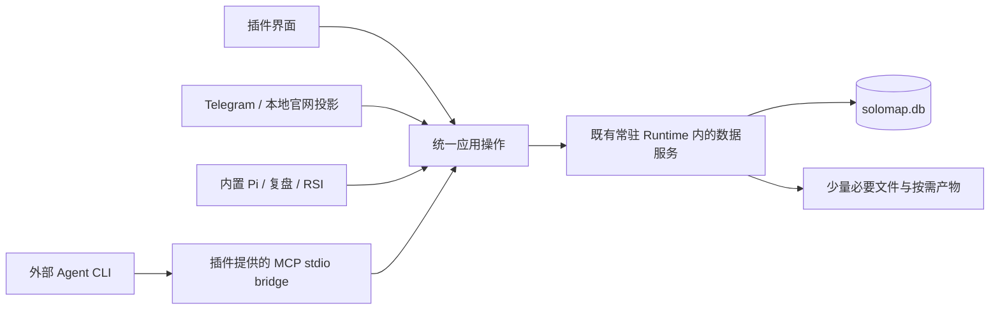
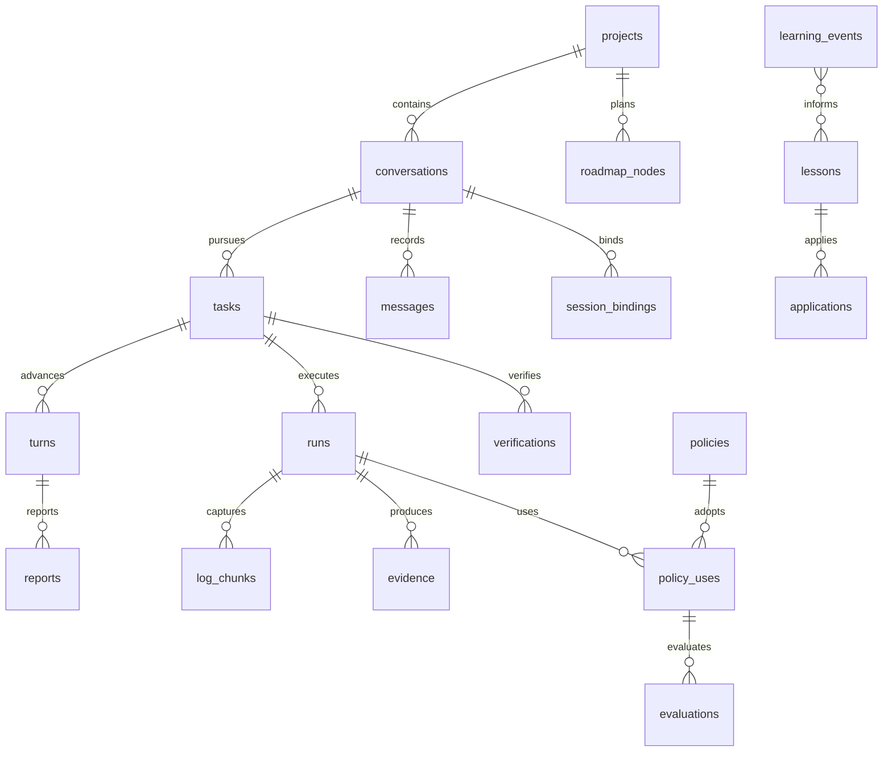

# SoloMap 单一数据库、文件清单与 MCP 数据入口蓝图

设计定稿：2026-10-05。状态：实施依据，尚未迁移。本文只定义存储与接入终态，不修改路线图状态、执行权限、Agent 选择、发布路径或既有功能完成标准。

## 1. 最终结果与设计边界

用户明确要求：后续只保留少量必须的本地文件、一个承载完整功能的数据库文件，以及插件提供的一套 MCP 数据查读写入口，以保持整洁、降低维护难度并支撑数据 RSI 飞轮。

终态固定为：

- 每个 SoloMap 数据根只有一个权威数据库：`.solomap-global/solomap.db`，承载该数据根登记的全部项目与全局数据。
- `.solopreneur` 不再保存项目数据库、运行历史、状态哨兵、学习记录或派生索引。
- 同一数据层服务插件界面、常驻 Runtime、内置 Pi、外部 Agent、Telegram、经验复盘与官网本地投影。MCP 是统一对外协议；内部调用复用相同应用操作，不绕过业务语义直接改表。
- 项目与全局的归属在数据库内表达，不再通过不同文件体系表达。
- 全文、日志、报告、附件原件和历史版本可回读，不以减少文件为理由缩短上下文、丢弃证据或降低功能。
- 源码、用户正式文档、实际发布产物和外部软件自身必须执行的文件保留原有用途；“一个数据库”不表示把用户项目打包成数据库。

这里的“一个”以用户配置的一个数据根为单位，不是每个项目一个库。多设备各自仍有本地数据权威；不借此引入云端数据库、网络共享库、第二套同步系统或跨设备自动合并。

### 与旧文档的关系

本文取代后续存储设计中的以下约束：项目 journal/growth 分库、原始日志永久留在运行目录、digest/graph/学习候选持续落成独立文件、项目与全局分别作为文件状态源。

旧文档仍准确记录历史实现；本文不宣称现有代码已经采用新结构。`run-index-database-layer.zh.md`、`project-growth-data-layer.zh.md`、`autonomous-runtime-rsi-blueprint.zh.md` 中与上述存储终态冲突的部分，以本文为后续实施依据。自主权、真实验证、会话身份、本地优先、远端密文中继与协作权限边界继续有效。

## 2. 当前实现锚点

| 已核对的事实（Observed in code） | 当前入口 | 新设计处理 |
| --- | --- | --- |
| 运行生成器分别写 prompt、command、snapshot、session、completion、脚本及时间标记 | `src/extension.ts` 的运行生成链 | 内容入库；共享 runner；必要文件仅按需生成 |
| 路线图 CSV 与项目 journal 使用不同存储职责 | `src/db/csvStore.ts`、`src/db/sqliteStore.ts` | CSV 保留 Git 编辑契约，运行数据统一入库 |
| 生长分析另用 project_growth.db | `src/projectGrowth.ts` | 同库生长表，不再创建第二个数据库 |
| 每轮报告正文、回执、任务归属分别写 JSON | `src/taskReport.ts` | 任务、轮次与报告记录在同一事务链关联 |
| 写 digest 后重写 execution graph | `src/runDigest.ts` | 摘要入库；图由关系查询生成 |
| 事件、候选、处置、建议与复盘应用凭据分别写文件 | `src/learningLedger.ts`、`src/learningReviewApply.ts` | 学习表、应用记录与来源游标入库 |
| 全局活动会话及租约通过独立 JSON/文件管理 | `src/activeConversationLedger.ts`、`src/scheduledTaskLedger.ts` | 会话、租约、调度与幂等记录入库 |
| Runtime 状态、配置、TG 通知队列落盘 | `src/autonomousRuntime.ts`、`src/cognitiveRuntimeConfig.ts`、`src/telegramRuntimeConfig.ts` | 状态、设置、队列入库，启动发现单独保留最小入口 |
| DB 保存是内存 sql.js 整库导出后覆盖文件 | `src/db/sqliteStore.ts` 的 `save()` | 改为磁盘增量事务，不沿用整库导出作为在线保存 |
| 现有 MCP 只有四项只读查询，使用进程内 transport | `src/intelligenceMcp.ts`、`src/intelligenceReadTools.ts` | 扩展统一应用操作与外部 stdio 接入 |
| 记忆工具、经验工具和复盘直接按文件检索 | `resources/tools/solomap-memory.cjs`、`resources/tools/solomap-experience.cjs`、`src/learningReview.ts` | 一起迁移到同一数据层，旧命令只作过渡适配 |

推断（Inference）：单独把文件合并或增加表不会消除重复维护；只有生产者、消费者、身份和提交语义一起收敛，数据库才能成为唯一内部权威。本文据此设计，不把推断当已验证的性能结论。

## 3. 最终文件清单

### 3.1 常态目录

```text
<用户选择的数据父目录>/
└── .solomap-global/
    ├── solomap.db                    必须：唯一权威数据库
    ├── runtime/
    │   └── control.json              Runtime 活跃时：本机进程发现与短期连接凭据
    ├── packages/                     安装了外部技能/MCP/增强能力时才有
    │   └── <package-id>/<version>/…   必须实际执行或直接读取的包文件
    ├── tmp/                          确实需要物理路径时按需生成
    │   └── <operation-id>/…          仅属于当前操作，无第二份历史权威
    └── exports/                      用户明确导出时才有
        └── <用户指定产物>             用户保留的报告、备份或交换文件

<项目>/
├── 用户原有源码、配置、文档与实际产物
├── agent.md / AGENTS.md / …          原有外部 Agent 规则入口，保留存在者
└── .solopreneur/
    ├── project.json                  必须：稳定项目身份，不保存机器绝对路径
    └── roadmap.csv                   有路线图的项目：Git 可读、可编辑的规划文件
```

目录是最终布局，`packages/` 的合并在正式安装适配器迁移后执行；不能先移动现有包而让入口失效。用户可以在导出时指定其他目录，`exports/` 不强制存在。

### 3.2 逐项保留理由与写入规则

| 文件或类别 | 是否保留 | 唯一用途与写入条件 |
| --- | --- | --- |
| `.solomap-global/solomap.db` | 必须，1 个主数据库文件 | 所有内部状态、内容、历史、关系与索引；只经统一数据层增量写入 |
| `.solomap-global/runtime/control.json` | Runtime 活跃时最多 1 个 | 复用已有本地发现职责；保存协议版本、runtimeId、进程连接位置及短期本机连接凭据；不存项目列表、业务状态、长期秘密或日志；启动/更换连接时更新，不随每轮任务增长 |
| `.solopreneur/project.json` | 每个登记项目 1 个 | `schemaVersion`、`projectId`；项目移动不改变身份，路径由库内设备位置记录管理 |
| `.solopreneur/roadmap.csv` | 已有路线图的项目保留 | 保持 Git 和外部编辑路径；不承担运行日志、Agent 当前状态、学习及后台状态 |
| 用户已有规则文件、正式文档 | 保留 | 内容是用户或项目正式资产；文档索引与编辑历史入库，不复制成另一套自动记忆文件 |
| 外部包文件 | 按安装能力保留 | `SKILL.md`、二进制、JS 包、第三方要求的 manifest/config 等确实被外部程序读取者；SoloMap 自己的登记、来源锁、健康、授权等元数据入库 |
| VS Code 设置、Agent 自身配置、OS 服务注册与密钥存储 | 宿主实际要求者保留原契约 | 属于宿主/外部程序入口；库中保存内部设置权威、引用或部署状态，不复制出每项目或每次运行版本 |
| 临时提示词、附件解包、安装输入、外部工具配置片段 | 临时 | 能用 stdin/MCP/字节流就直接传递；必须传路径时按 operationId 生成，存内容 hash 和用途；活跃消费者结束后按已授权生命周期回收 |
| 正式报告、图片、视频、发布制品与用户备份 | 用户明确产物 | 保存到用户要求的项目或导出路径，库内登记来源和摘要；不是碎文件清理对象 |
| SQLite WAL、SHM 或事务临时文件 | 引擎运行需要 | 可能出现 `solomap.db-wal`、`solomap.db-shm` 等少数辅助文件；它们不是第二数据库，也不是可手工清理的日志 |

核心计数：全局 1 个主数据库；常驻运行时最多 1 个发现文件；每项目 1 个身份文件，有路线图再保留 1 个 CSV。数量不随任务、轮次、经验候选或快照增长。包文件、正式产物、宿主必需文件与活跃临时文件另按实际用途存在。

SQLite WAL 存在运行期辅助文件，且不能把主文件单独复制当成在线完整备份。正常关闭与导出应由引擎完成 checkpoint 或一致性备份；崩溃后的 WAL 是恢复数据，不能为整洁强删。[SQLite WAL 官方说明](https://sqlite.org/wal.html)、[SQLite Backup API](https://sqlite.org/backup.html)。

### 3.3 不再长期生成的 SoloMap 文件

以下是迁移后的退役目标，不是本轮删除清单。存量必须先导入、核对消费者并取得具体删除授权。

| 现有文件/目录 | 数据库归属或最终处理 |
| --- | --- |
| `project_journal.db`、`project_growth.db` | 导入单一数据库的运行、生长、版本表 |
| `agent-runs/**/prompt.txt`、`command.txt`、`session.json`、`completion.json` | 内容、会话绑定、运行及轮次记录 |
| `started_at`、`finished_at`、`agent.pid`、`codex-home.txt` | 运行时间、进程身份、执行器上下文 |
| `workspace-before.json`、`roadmap-before.csv`、`changes.txt`、`touched-files.txt`、复核 patch/manifest | 原始内容与证据；结构化变更入索引 |
| `output.log`、诊断日志、后台事件 JSONL | 分块原始日志与结构化事件；不只保存 tail |
| `run-agent.sh`、每次生成的 runner、项目 runtime 工具副本 | 插件发行包提供共享 runner、MCP bridge、检查点适配器，不为每次运行复制程序 |
| `task-report-input.json`、`task-report-*.json`、`task-report-status-*.json`、`learning-tasks/*.json` | 报告提交、回执、任务/轮次归属 |
| `run-digests/`、`execution-graph.json` | 运行摘要、关系和查询投影 |
| `agent-status/`、`.agent_status.json`、`step-sessions/`、`active-conversations/` | 运行状态、稳定会话、租约和宿主事件 |
| `step-memory/`、SoloMap 自动创建的 inbox/active/结构化记忆文件 | 记忆内容、版本、归属与来源；外部约束入口例外见下文 |
| `documentation.json`、项目/全局 README、方法论与 bootstrap 自动副本 | 文档索引入库；固定帮助与方法论放发行包；已有用户修改内容导入并保留版本 |
| `validate-roadmap.cjs`、全局 `tools/`、SoloMap 自己的 `bin/` 副本 | 复用发行包入口；宿主或第三方确有路径合同者按包文件处理 |
| 项目 issues/PR/security/delivery cache、sidebar snapshot、日报与策略 JSON | 远端投影、派生投影与分析记录 |
| `projects.json`、portfolio/dependencies/capability/conflicts CSV、metrics CSV | 项目、关系、能力登记、判断与度量 |
| `learning/`、`maintenance/runs/`、复盘 proposals/reviews/application/before-* | 事件、经验、复盘批次、提案与应用日志 |
| `runtime/state.json`、认知/TG 配置、events/feedback、telegram-outbox | Runtime、设置、事件、消息队列；秘密按加密规则处理 |
| `scheduled-tasks/`、`automation-tasks.jsonl`、Flow JSON | 调度、触发、任务、执行及工作流循环 |
| skills/mcp/enhancements 的 registry、SoloMap manifest/source.lock/health、安装运行目录 | 集成登记、包版本、安装操作、内容及健康记录 |
| conversations/intelligence-conversations/daily/strategy/usage/diagnostics 的内部记录 | 会话、分析、计量、原始日志与投影 |
| 内部 trash/recycle、迁移标记与同步适配元数据 | 归档、版本、迁移游标、外部来源绑定 |
| `.solopreneur/attachments/` 中作为内部消息附件的原件 | 默认 BLOB 入库；实际项目成品继续保留在项目中 |

已有 `global-default-prompt.md`、profile/rules/project memory 等由 MCP 或插件按需读取数据库内容；如外部 Agent 必须发现文件，启动适配器注入对应内容或在 `tmp/` 生成本次只读上下文。用户独立维护的 `agent.md`、AGENTS.md 和正式 Markdown 文档继续是外部文件权威，不擅自接管。

可选 CloudMCP 记忆来源已有 contract/entries 文件写入合同。终态要求正式来源适配器能经统一入口读写且保持原有 scope、revision、hash、撤销与远端授权语义；不能仅停掉 SoloMap 写文件却保留外部生产者继续写。外部合同未迁移时，相关文件只属于有明确退出条件的过渡例外，不计为完成，也不自行修改外部服务或删除其治理记录。

## 4. 单一数据层与进程关系



常驻 Runtime 是正式持久化连接拥有者，复用已有用户级服务，不另起第二个 daemon。外部 MCP bridge 是轻适配器，每个 Agent 可有自己的 stdio 会话，但连接同一个数据服务和数据库。关闭 VS Code 窗口不关闭正在服务后台任务的数据连接；暂停自主任务也不暂停数据读写。

实例身份继续绑定 OS 用户、数据根与设备。插件、bridge 和后台模块不各自持有可覆盖全库的内存快照。服务不可达时先走既有启动、发现和恢复路径；不得静默改写旧文件作为第二套权威，也不得丢掉未确认的合法请求。

插件的打开、切换、输入和初始骨架不等待数据库迁移、全库扫描或 MCP 建连；数据服务异步补齐，按源 revision 防止晚到结果覆盖用户新动作。

SQLite 使用真实磁盘连接和增量事务，禁止在线 `db.export()` 覆盖。驱动随插件发行包提供，不要求用户安装系统 sqlite3；实施须在支持的 Extension Host 与独立 Runtime 平台验证加载、升级和备份。设计不绑定某个尚未验证的 Node 原生 ABI。

默认 WAL 与持久事务，只有一位正式写连接拥有者。应用更新、审计事件、幂等回执、必要后续投递在同一事务提交。日志分块批量写，不按 token 整库保存；终态前提交已接收的日志和证据。高耗时网络、Agent 调用与文件生成不占用数据库事务。

并发和即时是硬性验收条件：多项目、多窗口和多个 Agent 可以同时提交请求；写入回执只在持久事务提交后返回，收到成功回执后的新读取必须立即看见该版本。事务由唯一拥有者顺序提交，同版本竞争明确返回冲突，其他项目仍可独立读写。验收同时记录真实存量下的提交到回读延迟、查询耗时和宿主响应。

## 5. 数据模型总约定

### 5.1 身份、类型与共同字段

- 新对象使用稳定 UUID 文本 ID；旧数字 executionLogId、节点 ID 保存在迁移别名中，不跨项目直接复用为全库主键。
- `project_id` 为空明确表示全局归属；设备、Actor、配置归属使用显式字段。查询必须带已解析 scope，不能从名称、路径前缀或 Agent 自报推断权限。
- 设备路径属于 `project_locations`；项目移动不改变 `project_id`。克隆同一项目保留逻辑身份，由 location 区分；用户明确创建新项目才分配新身份。
- 时间统一存 UTC 毫秒整数，展示按用户设置时区；布尔使用 0/1，计数和 token 使用 INTEGER，文本 UTF-8，原始字节 BLOB。
- 可修改业务对象有 `revision`、`created_at`、`updated_at` 和归档状态；补丁未给出的字段保持原值。
- 下列表字典省略共同字段：领域实体扩展表包含固定 `object_kind`；项目领域实体还包含非空 `project_id`。它们分别与 objects 的 `(id, kind)`、`(id, project_id)` 关联，项目字段用于外键与索引，不允许独立修改归属；全局扩展表不伪造项目身份。实体创建与其 objects 行在同一事务完成。
- 对字典未另列主键的关联表，必须用列出的唯一业务键作为主键；设备位置另有稳定 id。项目实体的 created_at/updated_at 与共同对象版本在同一事务更新，供领域列表索引使用。
- 用于筛选、排序、关联、唯一性和状态判断的字段是正式列。JSON 仅用于有 schemaVersion 的供应方扩展、报告结构和稀疏可选数据，不把整个系统塞进无约束 key/value 表。
- 外键启用；关键关系和唯一性由 DB 约束。项目数据默认不级联物理删除；归档/撤销/取代不抹除历史证据。

### 5.2 共用身份与内容底座

| 表 | 关键字段与约束 | 职责 |
| --- | --- | --- |
| `schema_migrations` | `version PK, checksum, applied_at` | 数据结构迁移版本与不可变摘要 |
| `database_meta` | `key PK, value`；仅系统初始化项 | 数据根 identity、schema/protocol version；不存业务对象 |
| `objects` | `id PK, kind, project_id FK, revision, created_at, updated_at, archived_at` | 可引用业务对象统一身份；各领域实体以同一 id 扩展，跨域关系可用真实外键 |
| `devices` | `id PK, name, environment, credential_ref, last_seen_at` | 本地设备身份，秘密只引用 |
| `actors` | `id PK, kind, provider, identity_ref, authority_id FK actors` | 用户、执行器、宿主、外部来源；连接单独记录来源，继承持久主体的授权，重连不能重置已撤销、过期或收窄的授权 |
| `projects` | `id PK/FK objects, name, type, priority, description, hidden, pinned_at` | 项目登记；项目对象自身为全局对象，项目内对象引用它 |
| `project_locations` | `id PK, project_id FK, device_id FK, root_path, status`；活动路径唯一 | 同项目多路径/设备与移动恢复；检测 clone identity 冲突，不能静默合并两次运行 |
| `contents` | `id PK, sha256, mime_type, encoding, byte_length, stored_byte_length, data BLOB, chunk_index_json`；hash/length 校验 | 原始全文、补丁、JSON、附件与版本内容；大正文分块压缩、逐块校验，分页只读取对应数据块；保留完整原字节长度及 hash，内容去重，读取核对所属对象权限 |
| `content_chunks` | `(content_id FK, ordinal) PK, data BLOB`；单块最多 64 KiB | 大正文以独立数据行保存；分页通过主键读取对应块，避免 SQL 表达式先加载整份 BLOB |
| `object_revisions` | `(object_id FK, revision) PK, content_id FK, actor_id FK, reason, created_at` | 规则、记忆、设置、提案等可追踪版本；日志流不逐块创建对象版本 |
| `relations` | `source_id FK objects, relation, target_id FK objects`；三元组唯一 | 父子、来源、证据、依赖、采用、取代、反馈归属；枚举关系并校验两端 kind |
| `migration_items` | `(source_identity, source_key) UNIQUE, source_hash, object_id FK nullable, imported_revision, source_content_id FK, source_capture_revision, source_capture_request_id FK, stage, error` | 文件/旧库来源、幂等导入、错误与核对状态；原始字节及捕获回执先入库，未确认项目归属者保留为 unmapped，不变成全局记忆；捕获内容 hash 与最后应用的 source_hash 分别核对，迟到旧来源不得覆盖较新的数据库修改 |

`objects` 只统一身份、scope、revision 与跨域外键，不成为第二套领域状态。具体会话/任务/授权状态只在对应领域表定义。它的用途是避免每个功能各自实现文件引用、归属、版本和证据链接。

### 5.3 项目、规划与正式资产

| 表 | 关键字段与约束 | 职责 |
| --- | --- | --- |
| `roadmap_nodes` | `id PK/FK objects, local_node_id, title, description, stage, order_key, status, agent_cli, agent_prompt_content_id, completed_at`；项目/local_node_id 唯一 | CSV 已接纳版本的查询状态，保持原节点语义 |
| `roadmap_dependencies` | `(node_id FK, dependency_id FK) PK` | 规划依赖，禁止跨项目误关联 |
| `file_bindings` | `id PK/FK objects, role, relative_path, accepted_hash, exported_revision, pending_revision, last_error` | 身份、CSV、用户文档与库的绑定；不复制整棵源码树 |
| `documents` | `id PK/FK objects, file_binding_id FK, role, status, solves, last_reviewed_at` | 正式文档索引与审计；正文以工作区文件为权威 |
| `assets` | `id PK/FK objects, name, content_id FK nullable, file_binding_id FK nullable, origin, sha256` | 消息附件入库，实际项目资产引用文件；两种正文位置必须恰有一种 |
| `integrations` | `id PK/FK objects, kind, title, status, package_version_id FK nullable, config_content_id FK, secret_ref, health_content_id FK` | 技能、MCP、增强能力与渠道登记、配置、健康和来源 |
| `package_versions` | `id PK/FK objects, package_key, version, source, digest, installed_relative_path`；包/版本/digest 唯一 | 实际执行文件来源与版本；同版本复用，不每轮复制 |

源码与 Git 的真实状态继续来自工作区。库内保存被实际使用的版本、摘要和证据；仓库路径改变不让历史证据失效。

### 5.4 会话、任务、运行与验证

| 表 | 关键字段与约束 | 职责 |
| --- | --- | --- |
| `conversations` | `id PK/FK objects, parent_conversation_id FK nullable, node_id FK nullable, mode, status, title` | Solo、步骤、Flow、智能内核及 TG 对话；保持父子归属 |
| `messages` | `id PK/FK objects, conversation_id FK, sequence, role, content_id FK, turn_id FK nullable`；对话/sequence 唯一 | 消息正文、补充输入与顺序，来源通过 relations 关联 |
| `tasks` | `id PK/FK objects, conversation_id FK, node_id FK nullable, original_request_content_id FK, criteria_content_id FK, status` | 用户目标与验收，不把会话退出当任务完成 |
| `turns` | `id PK/FK objects, task_id FK, sequence, request_content_id FK, outcome, summary_content_id FK, started_at, finished_at`；任务/sequence 唯一 | 每轮检查点及汇报，不依赖物理报告文件 |
| `runs` | `id PK/FK objects, task_id FK, turn_id FK nullable, conversation_id FK, location_id FK, run_kind, actor_id FK, command_content_id FK, prompt_content_id FK, status, started_at, finished_at, duration_ms, exit_code, input_tokens, cached_input_tokens, output_tokens, reasoning_output_tokens, total_tokens, usage_json` | 每次执行，保留完整命令、输入与常用计量；usage_json 仅保留供应方扩展 |
| `session_bindings` | `(conversation_id FK, binding_revision) PK, provider, native_session_id, state, contract, evidence_id FK, provider_context_content_id FK` | 原生会话稳定身份与修订；名称/工具版本不使既有绑定失效 |
| `log_chunks` | `(run_id FK, stream, sequence) PK, content_id FK, recorded_at, byte_offset` | 完整 stdout/stderr/协议日志，按字节重组与分页读取 |
| `run_changes` | `(run_id FK, relative_path, role) PK, change_kind, before_content_id FK nullable, after_content_id FK nullable` | 触达/变化索引与可用快照；历史未保留字节时标明缺口 |
| `evidence` | `id PK/FK objects, run_id FK nullable, type, source_actor_id FK, content_id FK nullable, file_binding_id FK nullable, observed_at, source_revision` | 原始证据与位置、版本、来源；多项证据同属一次验证时明确关联 |
| `verifications` | `id PK/FK objects, task_id FK, run_id FK nullable, verifier_actor_id FK, claim, result, evidence_id FK, verified_at` | 实际验证结论；声明、无法验证和真实通过分开 |
| `reports` | `id PK/FK objects, turn_id FK, run_id FK nullable, schema_version, content_id FK, availability, validation_error` | 报告正文、版本、校验结果与提交回执 |
| `run_summaries` | `run_id PK/FK, summary_content_id FK, handoff_content_id FK, source_revision` | digest/handoff 查询投影，能回到原始证据 |
| `workflow_loops` | `id PK/FK objects, task_id FK, sequence, goal, status, planner_run_id FK, builder_run_id FK, verifier_run_id FK, scoring_content_id FK` | 既有 Flow 循环与角色结果；不改变现有入口 |

原始日志、绑定修订与证据追加后不原地覆盖；发现错误通过新事件/新修订纠正。任务、轮次、运行和会话的终态不同，不能借此次收库合并成一个 status。

### 5.5 记忆、经验与 RSI

| 表 | 关键字段与约束 | 职责 |
| --- | --- | --- |
| `memories` | `id PK/FK objects, category, title, status, confidence, content_id FK, valid_until, external_source, external_revision, canonical_hash` | profile/rules/project/decision/pattern/domain/inbox/active；保留来源和有效性 |
| `learning_events` | `id PK/FK objects, source_object_id FK, event_type, summary, occurred_at, source_revision`；来源/类型/版本唯一 | 真实结果与纠偏，不把重复观察生成新学习事件 |
| `lessons` | `id PK/FK objects, status, summary, applies_when, does_not_apply_when, do_this, avoid_this, verification, confidence` | 候选、批准、拒绝、晋升是同一条经验的状态/版本，不分目录复制 |
| `lesson_decisions` | `id PK/FK objects, event_id FK, lesson_id FK nullable, decision, reason, actor_id FK` | 无候选、拒绝、晋升、延期及反例，保持处置依据 |
| `review_batches` | `id PK/FK objects, input_cursor, input_hash, proposal_content_id FK, review_content_id FK, status` | 手动经验复盘、来源快照与断点续接 |
| `applications` | `id PK/FK objects, review_id FK nullable, lesson_id FK nullable, target_object_id FK, expected_revision, before_content_id FK, after_content_id FK, status, applied_revision` | 规则/记忆/策略应用与可恢复的前后版本 |
| `policies` | `id PK/FK objects, kind, status, content_id FK` | Prompt、上下文选择、路由或方法策略；对象 revision 即版本，不复制第二套策略库 |
| `policy_uses` | `id PK/FK objects, policy_id FK, policy_revision, lesson_id FK nullable, lesson_revision nullable, run_id FK, purpose` | 实际采用记录；召回不等于采用 |
| `evaluations` | `id PK/FK objects, policy_use_id FK, verification_id FK nullable, feedback_event_id FK nullable, metric, value, unit, baseline_ref, verdict` | 后续结果、成本和退化；可追踪指标来源，不以写入量充当进步 |

RSI 的闭环为：`task → run → evidence / verification → learning_event → lesson → application / policy revision → policy_use → evaluation → 下一次纠偏或晋升`。关系连接使用同库外键与版本，不靠文件名猜测。

一条经验被检索仅能记录召回事件；只有明确影响执行输入、策略或动作才写采用。没有后续验证就显示未评估。不同任务复杂度和基线必须保留，不能把更多运行/候选数量直接解释为能力提升。晋升权限与原有手动复盘入口保持，不因数据集中自动开放自主修改。

### 5.6 后台、设置、授权、队列与分析

| 表 | 关键字段与约束 | 职责 |
| --- | --- | --- |
| `settings` | `id PK/FK objects, namespace, key, owner_scope, content_id FK, secret_ref`；namespace/key/scope 唯一 | 非秘密配置、全局 Prompt、时区、Agent/模型选择、TG 开关等；补丁合并 |
| `ui_state` | `(device_id FK, view, scope_key, key) PK, value_json, revision` | 选中项目、展开、草稿等本地状态；不让后台读取覆盖新用户输入 |
| `runtime_instances` | `id PK/FK objects, device_id FK, pid, process_started_at, status, build_id, heartbeat_at` | 后台服务与活跃实例，PID 必须结合启动身份验证 |
| `leases` | `(resource_id FK objects, purpose) PK, owner_runtime_id FK, generation, expires_at` | 调度、活动会话与执行所有权；过期接管提高 generation，拒绝迟到旧 owner |
| `schedules` | `id PK/FK objects, timezone, trigger_spec_json, enabled, next_due_at, task_template_content_id FK` | 定时与自动触发配置 |
| `schedule_firings` | `(schedule_id FK, occurrence_key) PK, task_id FK, status` | 同一计划时点不重复发起任务 |
| `grants` | `id PK/FK objects, actor_id FK, target_id FK, action_set_json, revision, status, valid_until` | 保留现有动作、项目和能力授权；读写入口统一不表示扩大执行权限 |
| `events` | `id PK, sequence UNIQUE, subject_id FK objects nullable, actor_id FK, kind, content_id FK, created_at, request_id` | 已提交变更、宿主 lifecycle、纠偏及通知来源；不是用全量事件重放替代领域表 |
| `requests` | `(actor_id FK, idempotency_key) PK, id UNIQUE, input_hash, result_content_id FK, status, committed_sequence` | 可重试请求回执，以 id 关联事件与返回 requestId；同键不同内容拒绝；成功须能读回 |
| `outbox` | `id PK, event_id FK, channel, destination_ref, content_id FK, generation, state, attempt, next_attempt_at`；逻辑投递唯一 | TG 通知、文件投影、状态刷新等可恢复副作用 |
| `inbox` | `(channel, source_id) PK, content_id FK, state, acknowledged_at` | TG/远程意图接收与去重，重复消息不创建重复任务 |
| `projections` | `(namespace, scope_key, projection_key) PK, source_sequence, expires_at, content_id FK, last_error` | 侧边栏、日报、战略、远端 issue/PR/security/delivery、包健康及统计缓存 |
| `growth_snapshots` | `id PK/FK objects, git_head, reason, status, duration_ms, created_at` | 完整生长快照和分析历史 |
| `growth_items` | `(snapshot_id FK, item_id) PK, parent_id, kind, relative_path, label, metrics_json` | 文件/模块/能力明细，常用计量列化 |
| `growth_edges` | `(snapshot_id FK, source_item_id, target_item_id, kind) PK, weight, evidence_id FK nullable`；两端同快照外键 | 生长依赖与验证关系 |
| `growth_signals` | `(snapshot_id FK, signal_key) PK, item_id, type, level, value, evidence_id FK nullable` | 缺口与增长信号，运行信号按 run 去重 |

跨项目依赖与能力复用以 `relations` 连接项目/集成/策略；冲突决策以 decision 类 memory 及 evidence 保存。用量由 runs 的事实度量和 evaluations 聚合；需要独立外部账户观测时保存为带来源时间的 evidence/projection，不覆盖真实执行计量。

### 5.7 关键约束和索引

实施 DDL 必须包含而非仅靠文档约定：

- 所有子记录关联存在的项目/会话/任务/运行；同项目归属通过复合唯一键与复合外键约束。全局对象与跨项目关系按显式关系枚举校验。
- `objects(id, kind)`、`objects(id, project_id)` 唯一；领域扩展行的固定 kind 以 CHECK 与复合外键约束，防止把 memory id 当作 run id。可全局/项目共用的 kind 在全局记录上使用 NULL scope，并由专门 CHECK/触发器核对 objects 的 NULL 归属，不依赖包含 NULL 的外键自动生效。
- 子对象 scope 不得从可选字段缺失而消失；对话父子在同一项目，任务/轮次/运行关联同一目标，绑定原生 session 不靠 displayName。
- `contents` 字节长度由 CHECK 约束，hash/编码由统一内容写入和回读校验；evidence/asset 的存储位置 CHECK，禁止两处正文各自权威。
- `runs(project_id, started_at, id)`、`conversations(project_id, updated_at, id)`：最近运行与会话的稳定游标分页。
- `messages(conversation_id, sequence)`、`turns(task_id, sequence)`、`log_chunks(run_id, stream, sequence)`：顺序唯一。
- `memories(project_id, category, status, updated_at)`、`lessons(status, updated_at)`：上下文与学习筛选。
- `relations(source_id, relation)` 与反向 `(target_id, relation)`：来源、证据及采用链查询。
- 采用的 `(policy_id, policy_revision)`、非空 `(lesson_id, lesson_revision)` 必须引用 object_revisions 的真实历史版本，防止当前版本变化改写旧采用依据。
- `events(sequence)`、`outbox(state, next_attempt_at, id)`、`schedules(enabled, next_due_at)`：变化追踪及后台消费。
- `project_locations(device_id, root_path)` 活动路径唯一；同项目可有多个位置，但同一运行必须绑定精确 location。
- 不用 SQLite UNIQUE 对 nullable scope 的默认语义保证全局唯一：为全局和项目记录分别建立部分唯一索引。
- 正文全文检索索引在同一 DB 内；优先覆盖记忆、消息、报告和摘要，完整日志按 run 精确搜索。中文检索必须通过真实语料验证，不能把默认英文分词当成已满足要求。
- 所有列表先分页身份与小字段，再按需加载 contents；不为首屏扫描所有 BLOB 或每次重建全图。

外部 CLI 已有自己的原生 session 数据，SoloMap 保存绑定与取得的证据；不替代或删改 Agent 自己的历史库。

### 5.8 核心关系图

下图展示领域关系；跨域来源、证据、采用和取代链接实际通过 objects/relations 的受约束引用连接。



## 6. CSV、文档与数据库的一致性

数据库是 SoloMap 内部状态的唯一权威；CSV 仍是规划交换与 Git 编辑入口，源码、用户规则和正式文档仍是各自文件内容的权威。两者通过单一受控导入/导出合同衔接，不存在后台各写各的第二套内部状态。

1. 每次读 CSV 捕获当前内容 hash 和已接纳 revision，校验全部节点与依赖后，以一个事务接纳；更新节点与 binding 的 accepted_hash。
2. 插件/MCP 修改规划时先提交新的 DB revision 与文件投影 outbox；生成 CSV 前核对磁盘 hash 仍是已接纳版本，写入后回读并登记 exported_revision。
3. 文件已被用户/Git 修改时不得覆盖；先读取真实新内容，按基线进行字段级无冲突合并。有语义冲突才请求用户选择，原始两份内容均留库内，失败投影可续接。
4. 进程在 DB 已提交、CSV 未写完时崩溃，重启根据 pending_revision 与磁盘 hash 恢复；导出失败显示待保存，不自报已完成，也不把旧文件重新导入覆盖已提交状态。
5. 路线图导出仅在规划/节点状态有真实变更时执行；单纯日志、聊天、报告或经验更新不重写 CSV。

普通 Agent 不再通过随手改 CSV 推断任务完成；既有用户编辑路径保留，完成仍经原有真实验证与用户授权合同。仅讨论任务不得改变路线图状态。

## 7. 统一 MCP 合同

### 7.1 接入形式

发行包提供 `solomap-mcp` stdio 入口，由插件完成现有 CLI 配置接入；不把安装目录的版本路径写进长期用户配置，使用稳定 launcher/宿主支持的配置引用。bridge 只负责协议、当前主体与项目解析，连接已有 Runtime 数据服务。

使用 SDK 的正式 tools/resources 能力；stdio 输出仅 MCP 帧，诊断走 stderr 或库内日志。stdio 是该本地数据入口的正式外部接入方式；本轮不另开公网 HTTP 数据库入口，不改变现有官网中继。[MCP Transports 官方规范](https://modelcontextprotocol.io/specification/2025-11-25/basic/transports)。

插件内部与 Pi 可以保留同进程 transport，但工具合同和应用操作必须相同，不能成为另一套实现。现有四项只读查询作为兼容别名消费相同查询层，迁移结束不保留另一套配置/项目缓存。

不支持 MCP 的已有执行器，继续由宿主提供上下文与捕获结果，必要时以发行包轻适配器调用同一应用层；用户仍使用现有 Agent 入口，无需选择第二种数据模式。Agent 不执行自报命令时，宿主 lifecycle 事件仍能确认运行与收口。

### 7.2 工具集合

“一套入口”意味着一个 server、一套身份与项目语义、一套可复用操作，并不表示用一个无类型 SQL 工具包办所有动作。

| 工具 | 输入核心 | 结果与用途 |
| --- | --- | --- |
| `solomap_search` | `query, scope, kinds, filters, cursor, limit` | 带 objectId/revision/来源的匹配摘要；查询、筛选、时间范围与分页 |
| `solomap_read` | `ref, revision?, view?, cursor?` | 对象全文、关系、版本、原始证据或分块日志；只读引用不绕过权限 |
| `solomap_write` | `kind, action, scope, objectId?, expectedRevision?, idempotencyKey, data, provenance` | 创建、精确补丁、追加或归档；返回已提交版本与回执 |
| `solomap_link` | `sourceRef, relation, targetRef, expectedRevision, idempotencyKey` | 关联证据、来源、依赖、纠偏、采用与评估；关系类型校验 |
| `solomap_context` | `projectId?, taskId?, query, categories?, budget?` | 当前目标、规则、相关记忆/经验及来源；按需上下文，不灌全库 |
| `solomap_export` | `ref, format, destination?, idempotencyKey` | 完整报告、日志、规划、附件或项目交换包；按请求生成文件 |

标准 resources 提供 `solomap://objects/<id>`、对应版本和内容分页引用，统一复用 read 权限。工具 schema 中列举支持的 kind、动作及字段，返回可操作的错误，不要求 Agent 猜表名。

`solomap_write` 进入正式领域操作：可修改用户输入不等于可自报通过验证；提交结果不等于结束运行；新增经验不等于晋升策略；请求停止不等于执行已停止。证据与状态写入必须绑定宿主/验证者来源。需要执行副作用的任务仍走现有授权与执行入口。

actor、权限与已观测来源由连接和宿主确认；请求中的 provenance 只是补充来源声明，不能自报成用户、宿主或独立验证者。

任意 SQL、DDL、DB 文件路径、密钥读取和全库扫描不作为普通 Agent 工具。用户要的是完整查读写能力，工具必须覆盖所有正式可操作的数据种类，不能以“治理”名义只给搜索而不能写。

### 7.3 一致请求语义

读响应统一包含 `objectId, kind, scope, revision, sourceRefs`，列表带 `cursor, snapshotSequence`。全文可分页/分块，不静默截断。

游标绑定筛选条件、scope、排序和源版本。可变列表在分页期间发生变化时返回明确的刷新标记并重新读取，不能声称跨多次请求一直持有原快照；不可变日志流按已确认 sequence 分页。

写响应统一包含 `requestId, status, objectId, revision, committedSequence, pendingEffects`：

- `committed` 仅表示本地事务已持久提交。
- CSV、通知或其他副作用尚未完成时如实保留 pendingEffects；重试同请求返回同回执。
- 更新必须比较 expectedRevision；旧读结果无权覆盖新状态，同幂等键不同输入返回明确冲突。
- 归档不等于物理删除；权限变更、策略晋升与执行动作继续遵守现有责任边界。
- 客户端项目上下文由已绑定会话自动提供；多项目 Agent 明确选择项目即可，不要求声明数据库、内部 scope 类型或 provider 特例。

## 8. 秘密、数据归属与恢复

普通内容集中不表示把秘密明文放入库或 MCP。现有账户/设备/Agent 凭据沿用宿主安全存储；DB 保存引用。常驻 Runtime 必须能在 VS Code 关闭后使用获授权秘密，实施须验证真实后台可用性，不能只证明 Extension Host 可读。

确有跨进程持久凭据需要入库时，以加密 envelope 保存在 contents，并以系统密钥存储管理解密材料；MCP 普通读取、日志、导出、RSI 与搜索不得解密暴露。现有 TG 配置中的凭据按该正式合同迁移，不借机轮换账号或扩大授权。

单一数据库必须提供：

- 全库一致性备份，使用 SQLite backup/checkpoint 合同而不是复制正在变化的主文件；备份产物不是第二个在线数据库。
- 单项目交换包，包含必要身份、规划、运行、证据、记忆、附件和来源版本；恢复导入同一个目标库，默认不携带长期秘密或跨项目私有记录。
- 原数据根和项目移动恢复；`project.json` 本身不是完整项目历史，数据库备份/项目导出是带走历史的正式路径。
- 集中数据根不可达时不得生成空库冒充原状态；明确恢复原连接、定位备份或导入。新项目登记与恢复已有库是不同动作。
- 用户归档和保留策略在库内明确执行，不自动删除旧日志/证据/经验。物理删除历史文件仍须精确清单与用户明确授权。

数据根保持现有用户配置入口，但实施时须把已登记项目解析到同一固定数据根，不再因为当前工作区不同而默默生成另一个默认根。已有多个数据根先枚举并选择正式合并目标，不能自行丢弃。

## 9. 迁移顺序与消费者清单

所有阶段服务同一终态，过渡双读/旧文件仅用于兼容，不能变成永久产品模式。

| 阶段 | 必须交付 | 收口证据 |
| --- | --- | --- |
| A：盘点与底座 | 精确数据根/项目身份、单库 schema、真实磁盘事务、Runtime 数据服务、启动发现与备份 | 旧库只读盘点；新库读写/崩溃恢复/备份验证；不影响旧任务 |
| B：共享操作与 MCP | 同一领域操作、stdio bridge、内部 adapter、上下文与工具合同 | 外部 CLI 与内部 Pi 能读、查、写、回读同一对象和 revision；关闭窗口后仍可用 |
| C：历史导入 | journal/growth、运行正文、报告、学习/记忆、设置、队列、包登记及所有原始引用 | migration_items 源目标计数、hash、关系与状态对账；中断重跑不重复、不覆盖新版 |
| D：消费者切换 | 新任务只写单库，历史消费者全部通过同一层读取 | 全部消费者下表通过，运行/复盘不再新增永久碎文件 |
| E：退役与验收 | 正式接入包、提示词、旧脚本、外部写入来源与历史路径一致切换 | 旧入口不再写；准确列出存量待处理文件，获授权后逐项清理并复查；无批准时保留存量且明确未清理 |

正式消费者必须覆盖：

1. 项目登记、隐藏/排序、设置和 UI 草稿/展开/选中状态。
2. 路线图 CSV 编辑、Git checkout/pull 后接纳、规划变更与导出。
3. Solo、步骤、续聊、路线图讨论/调整、Flow、复核、CLI 安装/升级与包操作。
4. 会话身份、绑定修订、任务检查点、宿主 sentinel、报告回执、运行结束与后台恢复。
5. 贡献/投资/token 统计、digest/handoff、执行图、生长快照/报告与文档索引审计。
6. 记忆/经验检索、外部可选记忆适配、复盘收集/提案/验证/应用及 RSI 采用与评价。
7. Runtime 租约/授权/调度、TG 接收/发送/身份代次、智能对话、通知和本地官网投影。
8. issues/PR/security/delivery 等远端投影、日报/战略、渠道与领域插件自己的内部记录。
9. 安装包来源、版本、配置、健康与能力登记，以及用户原有秘密和宿主配置。
10. 备份、单项目导出、恢复、项目移动/克隆、旧 ID 引用与原始附件/日志读取。

每类历史来源保留 `source_identity + source_key + source_hash`，旧引用转换成稳定 objectId；源内容变化重新核对，不能用 basename 或旧数字 ID 猜归属。无法解析、来源冲突、缺失正文、无可信 executionLogId 的历史记录均导入可追溯缺口，不伪造成功，不直接丢掉。

活跃旧任务必须先到可恢复边界再切换写入权，旧 shell、hook、checkpoint 和外部写入者未退役前不得清掉其文件；新旧写入不能同时修改同一权威记录。用户既有工作区和 Git 改动不为迁移覆盖、清空或隔离重建。

## 10. 最终验收合同

本蓝图的完成不等于运行时迁移完成。实施交付必须验证以下最终用户结果：

| 验收维度 | 通过判据 |
| --- | --- |
| 单库与文件数量 | 所有登记项目只使用同一个 solomap.db；连续运行、续聊、报告、复盘、生长刷新后不新增永久业务文件；活跃 tmp 与包/产物可精确解释 |
| 数据完整 | 原始 prompt/command/log/report/attachment 与旧来源 byte/hash 对账；会话父子、项目归属、状态和历史版本不丢失 |
| MCP 完整能力 | 真实外部 Agent 完成搜索、全文读取、创建、补丁、关联、上下文及导出；返回版本和来源，可回读；当前只读工具也保持可用 |
| 功能守恒 | 上述十类消费者从真实入口完成原动作；没有“只能查不能写”、隐藏入口或让用户选择数据库模式 |
| 生命周期 | 关闭窗口、Runtime 重启、DB 已提交/文件未生成、投递未完成、Agent 未执行检查点命令后均能恢复；不重复任务与外部副作用 |
| 并发与时序 | 多项目、多窗口、多会话并行；重复请求、迟到状态、旧 owner、源变更、CSV 冲突均不覆盖新结果或跨项目串写 |
| 性能与维护 | 用同一真实存量与工作负载比较新增文件、物理写入字节、读写延迟、宿主阻塞、首屏和恢复耗时；不以“文件少”代替性能证据 |
| RSI | 至少一条真实结果产生经验、经现有审核应用到后续动作、记录采用版本与后续验证；能定位有效、无效及退化，无法评估时如实显示 |
| 数据带走与秘密 | 全库备份、单项目导出/恢复可用；恢复内容完整且不暴露秘密或跨项目私有数据；项目身份文件不冒充完整备份 |
| 迁移收口 | 所有生产者停止旧写入、引用迁移完成、外部合同已切换；存量清理按授权逐项完成。未批准删除时明确历史存量保留，不声称目录已经整洁 |

验收前不设置未经测量的百分比收益承诺，不以缩短日志、限制合法任务时长或关掉既有功能换取整洁。数据库、MCP 与必要文件必须共同保持用户原有动作能完成。

## 11. 本轮交付范围

用户已授权按本蓝图实施，并明确要求支持并发和即时读写。当前工作区已实现磁盘 SQLite 驱动、领域事务、版本与回执、Runtime 数据入口、MCP stdio 桥接、内容分块、权限与在线备份；这些实现仍处于验证和迁移阶段，不代表生产消费者已全部切换。

并发不是用进程内整库快照各自覆盖文件。不同项目和会话通过同一 Runtime 提交事务，已提交写入可立即回读；旧兼容数据库连接也使用真实磁盘事务。运行权不能仅因心跳过期转交给另一存活进程，相同 runtimeId 也必须核对 pid。旧进程退出前不启动第二个数据库宿主。

记忆导入已接到 Runtime 的宿主操作：请求立即返回持久化 jobId，后台逐个来源提交并让出执行机会，每批保存进度，中断后续跑。控制入口先就绪，历史扫描与 outbox 恢复不阻塞建连；关闭时等待已接受工作到恢复边界后再关闭数据库。普通 MCP 会话不能调用宿主迁移和 CLI 配置操作。未确定项目归属的原文进入迁移记录，不提升为全局记忆；补齐映射可再次导入，重复相同任务不新增来源事件，来源变化不能覆盖较新的数据库编辑。

正常 Runtime 首次启动会建库，并在已有租约状态中保留数据库身份；已初始化数据库丢失时要求恢复，不创建空库替代。控制入口就绪后异步登记记忆和智能聊天历史迁移。项目旧 slug 有多个来源时，即便其中一个项目已断开，也只保留原文而不猜测归属。关闭自主工作仍保留数据读写入口。

智能聊天的新会话及续聊通过同库事务保存完整消息，保留原会话 UUID；侧栏和 Telegram 共用，旧 JSON 不再被更新。原始 JSON 字节独立留存，正文和元数据不混淆；并发续聊检测版本冲突并基于最新历史继续。侧栏异步历史响应不能覆盖较新的列表或已提交回复。

侧栏和项目设置共用“数据迁移与回收”卡片，显示来源保存、迁移状态、需查看项、可回收数量与大小；只有设置可见且迁移未结束时刷新，查看回收清单时暂停刷新。回收必须先展示精确文件清单，再经用户确认。当前仅已迁移且被数据库完整承接的智能聊天旧 JSON 可进入清单；仍被使用的记忆及其他历史文件不参与。回收前重新检查内容、文件身份、符号链接与项目边界，先移入可恢复的临时保留位置，再调用编辑器系统回收站；宿主不支持系统回收站时，由 Runtime 再次核验已提交的不可变快照和待回收文件后逐项回收，不要求用户安装工具。状态和不可变原始快照保存在同库 V6；中断和迟到编辑均保留数据，无法回收的文件可继续处理或恢复，恢复不覆盖已有文件。重复查看相同清单复用原计划，不增加永久文件或重复计划。

当前真实存量记忆验证采用隔离验证库，原目录保持不变：305 份 MD/JSON 原文全部通过字节核对，共 3,135,351 字节。仅显式映射一个已确定项目时导入 240 个记忆对象，65 份项目来源保留原文和待映射原因；重复导入未新增事件，外键检查和在线备份通过。该结果不包含生产迁移，也不表示原有 MD 写入入口已退役。

结构化 JSON 记忆也保留原始字节，并映射来源 ID、原版本、项目范围、撤销状态、标签、有效期、替代关系与来源证据。上下文排除尚未生效、到期和已撤销内容，但历史读取保留。V1 SQL 摘要不变，后续结构按独立版本升级。

数据库存在时，记忆初始化与全局工程初始化不再自动补建记忆、示例、README 或月度汇总 MD；已有文件保持不变。授权复盘的文件应用、旧经验账本和其他业务 CSV/JSON 写入仍待切换，这项初始化收口不等于所有旧写入已停止。

任务脚本在启动 Agent 前经 Runtime 安装 Codex、Claude Code、Cursor、OpenCode、Copilot、Grok、Antigravity 的原生 MCP 配置，保留其他服务器、凭据与权限；JSONC 使用字段补丁保留用户注释。TOML 在解析完整配置后检查目标占用，更新托管服务器时保留禁用状态等用户设置，并校验最终配置可解析。配置路径绑定发起任务的 CLI 环境，不由常驻 Runtime 的旧环境推断。配置使用内联 launcher 从既有 control.json 发现当前运行版本，不写固定插件安装路径，也不增加每轮配置文件或永久锁文件。项目身份从 CLI 工作目录向上查找既有身份，在另一个 Git 项目边界停止；Claude 使用其稳定项目目录。未知工作目录不会自动登记成项目。任务提示词说明六项数据工具、字段合同、全文分页、版本冲突、幂等重试和提交后回读。内部 Pi、插件聊天与 Telegram 在有数据库及已选项目时接入同一工具，并为一次对话固定项目范围。隔离原生 CLI 探测已确认 Claude 连接、Cursor 六项工具、OpenCode 连接、Grok 原生握手与六项工具，以及 Copilot 配置识别；Codex 目前通过原生参数解析及生成配置合同验证，尚未修改用户实际配置。各家原生审批和信任规则继续生效。

完整历史导入、十类消费者切换、用户实际 CLI 配置安装、RSI 采用与评估，以及旧写入入口退役仍需完成第 9、10 节的验收。最终文件清单仍是迁移终态；当前不得宣称目录已整洁或迁移已闭环，不部署未完成的消费者切换，也不删除存量文件。

设计依据：用户在本次会话明确的一数据库/少量必要文件/统一 MCP/数据 RSI 目标，以及第 2 节列出的当前源代码。SQLite 和 MCP 的外部协议事实采用上文直接链接的官方文档。
