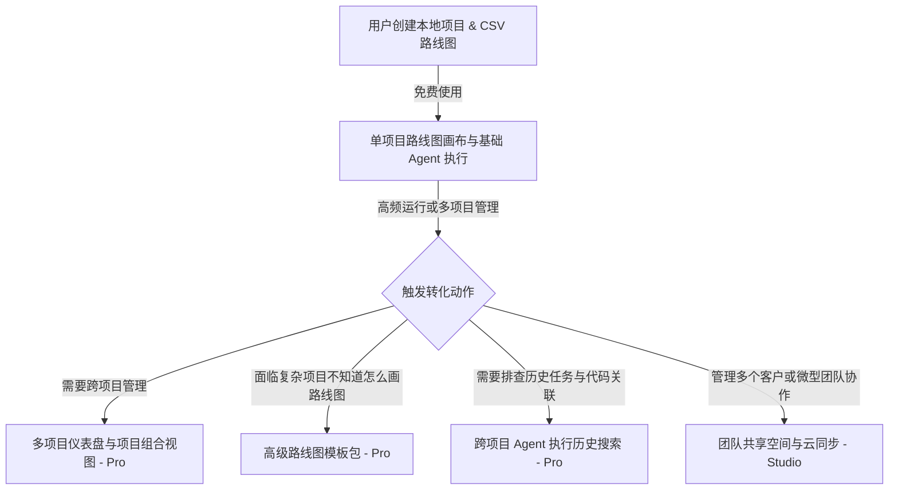

# SoloMap 早期发布与转化路径计划 (Launch & Conversion Plan)

本计划旨在将 SoloMap 已完成的本地优先、AI 路线图与任务流管理能力转变为可执行的发布行动、分发文案、用户触达脚本及转化策略。整个发布计划完全以“最终使用该产品的开发者视角”出发，隐藏底层技术架构，专注解决“使用 AI 编码时迷失方向、遗忘上下文”的痛点。

---

## 1. 目标渠道 (Target Channels)

根据 SoloMap 的目标人群（技术型独立开发者、Indie Hacker 及 Micro-SaaS 构建者），我们精选了以下高意向、高转化的发布渠道：

### 1.1 开发者垂直分发渠道
*   **VS Code Marketplace**：最核心的自然流量入口。优化搜索关键词、展示图与安装指引，利用安装量和好评积累权重。
*   **GitHub Repository**：通过开源或公开代码库吸引喜欢研究源码和关注本地优先（Local-first）理念的硬核开发者。
*   **Product Hunt**：获取全球科技爱好者的第一波曝光。选择在周二或周三发布，争取当日 Top 产品勋章。

### 1.2 国际独立开发者社区
*   **X (Twitter) Indie Hackers 圈**：关注 `#buildinpublic`（公开构建）与 `#indiehackers` 标签，直接触达每天发布项目进展的独立开发者。
*   **Reddit (r/SideProject, r/indiehackers, r/vscode)**：通过真诚分享工具设计初衷、解决的具体问题来发帖，严禁硬广，重在收集反馈和互动。
*   **Hacker News**：以“Show HN: SoloMap - A local-first VS Code extension for AI roadmap orchestration”形式发布，强调无云端依赖与 Git 友好的特性。

### 1.3 国内开发者与独立创作者社区
*   **V2EX (创意节点)**：国内最核心的技术人聚集地，发帖分享“我是如何用本地 AI 推进多个半成品项目的”，赠送早期 Pro 版测试码或 Lifetime 优惠。
*   **掘金 (独立开发 / AI 专栏)**：撰写深度应用案例，分析在 AI 编写了大量零散代码后，如何通过路线图和环境交接防偏航。
*   **小红书 / 微信朋友圈**：利用视觉性强的卡片图文，直击“副业项目多、AI 聊天散乱、项目烂尾”的焦虑点。
*   **Bilibili (独立开发 / 效率工具区)**：发布 2-3 分钟短视频，演示“一个想法从输入到自动生成路线图，再一步步用本地 Agent 执行完毕”的录屏。

---

## 2. 发布文案 (Launch Copy)

### 2.1 VS Code Marketplace 详细说明页面 (中英双语版)

#### English Version:
```markdown
# SoloMap: AI Roadmap & Agent Task Flow for Solopreneurs

Tired of losing your place when building side projects with AI? 
SoloMap turns your raw project ideas into structured, executable visual roadmaps directly inside VS Code, and orchestrates your local AI agents (like Claude Code, Cursor, or Aider) to complete them step by step.

### Why SoloMap?
When building alone with AI coding assistants, you don't need another generic code generator. You need a project operating system that answers:
1. "Where was I yesterday?"
2. "What is the exact next step to move closer to launch?"
3. "How do I hand over context to the AI without repeating myself?"

### Core Features:
*   **Visual Roadmap Canvas**: Turn ideas into a flow of milestones, from problem definition to final launch.
*   **Local Agent Orchestration**: Run your own installed CLI agents (Claude Code, agy, Cursor) directly from roadmap step cards.
*   **Step Memory & Handoff**: Auto-saves touched files, agent output logs, and step handovers in `.solopreneur/` to prevent AI context drift.
*   **100% Local-First & Git-Friendly**: No hosted backend. Your entire roadmap, conversation logs, and project history live in your directory. Back it up, diff it, and move it with Git.
```

#### 中文版本：
```markdown
# SoloMap: 面向独立开发者的 AI 项目执行驾驶舱

用 AI 写副业项目时，是否常因为中断几天就丢失了上下文？
SoloMap 在 VS Code 内部将你的项目想法转化为可视化的结构化路线图，并指派你本机的 AI Agent（如 Claude Code、Cursor、Aider 等）按环节自动执行任务。

### 为什么选择 SoloMap？
一个人用 AI 编码，缺的往往不是“代码生成器”，而是保证项目不烂尾的控制台：
1. **不再丢失上下文**：中断几天后重新打开，一眼看清“上次做到哪，下一步该做什么”。
2. **拒绝无效编码**：让 AI 围绕具体的路线图目标工作，而不是漫无目的地在对话框里修修补补。
3. **无缝环境交接**：自动将上一步的修改文件、执行输出和环节记忆传递给下一步，防止 AI 偏航。

### 核心功能：
*   **可视化路线图画布**：将想法拆解为从“问题验证”到“发布增长”的可视化步骤流。
*   **本地 Agent 调度**：在步骤卡片中直接调用你本机已有的命令行 AI 工具，在集成终端中协同工作。
*   **环节记忆与交接**：自动跟踪被修改的文件、运行日志和交接总结，Agent 启动时自动注入上下文。
*   **纯本地与 Git 友好**：不依赖任何云端后台。所有路线图数据、对话记录、项目记忆全部保存在 `.solopreneur/` 文件夹中，随 Git 一起提交和迁移。
```

---

### 2.2 V2EX 社区发布贴文案

*   **标题**：[分享] 写了十几个半成品项目后，我做了一个本地优先的 VS Code 插件来拯救我的 AI 编码焦虑
*   **正文**：
    > 各位 V 友，相信不少人和我一样，手头攒了一堆“副业想法”。自从有了 Cursor、Claude Code、Aider 这些强力 Agent 之后，写代码的效率确实起飞了，但很快我遇到了新的瓶颈：
    > 
    > 1. **上下文遗忘**：工作一忙，周末写的项目周四再看，AI 对话历史拉了几十屏，完全记不起上次改到了哪个文件，重新梳理上下文要花半小时。
    > 2. **方向偏航**：让 Agent 自由发挥，改着改着就重构了半天代码，结果偏离了最初的核心功能，主流程迟迟跑不通。
    > 3. **管理碎屑**：项目计划、TODO 列表、API 密钥、Agent 的运行日志和 touched files 散落得到处都是。
    > 
    > 于是我写了这个 VS Code 插件叫 **SoloMap**。它的核心定位是 **“面向独立开发者的 AI 项目执行驾驶舱”**。
    > 
    > **它是怎么解决这些问题的：**
    > *   **想法可视化**：它把你的想法直接梳理成一张步骤路线图（不仅仅是技术任务，还包含用户调研、定价设计、上线准备等商业阶段）。
    > *   **桥接你现有的本地 CLI**：你不用额外付费买新的 AI SaaS 服务。它直接在 VS Code 侧边栏和主面板里调度你本机装好的 Claude Code、Aider、agy 等，在集成的 Terminal 里跑任务。
    > *   **环节交接机制**：每当一个步骤跑完，插件会自动分析修改的文件列表，保存一份环节交接记忆（`.solopreneur/step-memory/`）。下一次启动 AI 时，它会自动参考上一步的成果，防止 AI “失忆”或“幻觉”。
    > *   **完全的本地所有权（Git-Friendly）**：所有路线图数据是一个 CSV，所有日志和环节记忆全部放在你项目根目录下的 `.solopreneur/` 文件夹。没有云端数据库，数据跟着你的 Git 仓库走，安全且极其轻量。
    > 
    > 插件目前已经在 Marketplace 上架，完全免费，数据全部归你所有。欢迎大家安装体验、提 Issue 或分享你的独立开发工作流。
    > 
    > 体验地址：[VS Code Marketplace 链接]
    > 开源仓库：[GitHub 仓库链接]

---

### 2.3 小红书图文文案

*   **图片设计建议**（可用图片生成工具产出）：
    *   第一张：高对比度对比图。左边是满屏杂乱的 AI 聊天对话框（写着“我又迷路了”），右边是 SoloMap 干净的可视化路线图和步骤卡片（写着“下一步：准备上线方案”）。
    *   第二张：VS Code 侧边栏与主画布联动界面，突出“本地优先，Git 追踪”的标语。
*   **标题**：拯救副业烂尾！用这个 VS Code 插件给你的 AI 指路
*   **正文**：
    > 💡 独立开发者最怕什么？不是代码写不出，而是项目太多，每个写了 20% 就因为丢失上下文废弃了。
    > 
    > 推荐一个超级实用的 VS Code 插件：**SoloMap**。它是一个专门帮你用 AI 推进项目的“本地执行控制台”。
    > 
    > ✨ 它的亮点：
    > 1️⃣ **想法变路线图**：输入一句产品想法，自动在 VS Code 里画出一条可执行的步骤流。
    > 2️⃣ **直接调度本地 AI**：一键调用你本地装好的 Claude Code、Aider、agy 等工具，在编辑器终端里帮你跑，不需要买额外服务。
    > 3️⃣ **自带记忆功能**：每一步改了什么、日志是什么都存下来。下次打开，AI 自动读取上一步的成果，拒绝失忆。
    > 4️⃣ **数据只存本地**：不连云端服务器。所有进度、对话记忆全存在项目根目录的 `.solopreneur/` 文件夹下，跟着 Git 一起走，安全感拉满。
    > 
    > 🔍 VS Code 搜索 **SoloMap** 即可免费使用。
    > 
    > #独立开发 #IndieHacker #AI编程 #VSCode插件 #副业项目 #程序员日常 #效率工具

---

### 2.4 X (Twitter) 平台推特链 (Thread) 文案

```text
1/ Tired of losing track of your side projects when building with AI agents? 
You start strong, get interrupted for a few days, open the editor, and have no idea where to resume. 
We built SoloMap to solve this. Directly inside VS Code. 👇

2/ SoloMap is a 100% local-first visual roadmap and execution dashboard. 
It bridges your ideas to structured milestones and drives your local CLI agents (like Claude Code, Cursor, Aider) to execute them without losing context.
[Attach a clean GIF/Video of Roadmap loading and executing]

3/ Unlike other SaaS project boards, SoloMap is Git-Friendly. 
All your roadmap data (CSV), agent run logs (SQLite), and step handovers are saved locally in a `.solopreneur/` directory. 
It version-controls with Git, diffs easily, and moves wherever your code goes.

4/ How it works:
1. Initialize your project directory.
2. Enter your idea, and let the agent generate a methodological roadmap.
3. Choose your favorite local CLI agent to execute step-specific prompts.
4. Auto-save touched files and execution memory to prevent prompt drift.

5/ We don't host your AI or sell expensive tokens. Bring your own local developer CLI agents, and SoloMap provides the visual coordination and historical memory they desperately need.

6/ Give it a spin for free:
Marketplace: https://marketplace.visualstudio.com/items?itemName=SZLK.solopreneur-roadmap
GitHub: https://github.com/jobssteve164dev/solopreneur-roadmap
Let me know your thoughts and suggestions. #buildinpublic #indiehackers
```

---

## 3. Marketplace 优化清单 (Marketplace Optimization Checklist)

为了在 VS Code Marketplace 获得更高的自然搜索曝光和安装转化率，必须对以下关键要素进行二次检查和持续优化：

| 优化元素 | 优化要求与标准 | 已实现/待优化内容 |
| --- | --- | --- |
| **标题与名称** | 必须采用 `SoloMap: AI Roadmap & Agent Task Flow`，包含高流量关键词。 | 已在 `package.json` 中配置为 `SoloMap: AI Roadmap & Agent Task Flow`。 |
| **副标题描述** | 简洁阐明核心价值，控制在 120 字符以内。 | 已设置为：`Turn your project idea into a roadmap your local AI agents can execute.` |
| **产品图标 (Icon)** | 128x128 像素，必须使用高清晰度、无锯齿、具有品牌辨识度的 Logo。 | 确保 `resources/logo.png` 的透明通道和圆角在 Marketplace 暗色主题下显示完美。 |
| **分类与关键词** | 选择 `AI`、`Chat`、`Machine Learning`、`Visualization`，并配置精密的 `keywords`。 | `package.json` 中已包含了 `ai, chat, agent, roadmap, workflow, local-ai` 等精选关键词。 |
| **高对比度动态图** | 在 README 顶部嵌入 2-3 个展示核心工作流的轻量高质 GIF。 | 准备补充：1. 路线图初始化生成过程 GIF；2. 步骤卡片内启动本地 Agent 终端的录屏 GIF。 |
| **状态徽章 (Badges)** | 嵌入 Marketplace 安装量、版本号、GitHub Stars、MIT License 等视觉元素。 | 已在 README 顶部配置 Shields.io 动态徽章。 |
| **快速上手步骤** | 采用最精炼的 1, 2, 3, 4 步骤配合命令指引，降低用户的初次探索阻力。 | 已提供双语 Quick Start 引导，并标注了首个入口命令 `SoloMap: Show AI Roadmap`。 |

---

## 4. 首批 20 个潜在用户触达脚本 (Outreach Scripts)

触达原则：**去广告化、提供具体价值、针对受众当前的真实痛点进行提问。**

### 4.1 国际渠道 10 个英文触达脚本 (针对 X、Reddit、HN)

#### 脚本 1：针对 X 上发布 `#buildinpublic` 并面临进度停滞的独立开发者
> "Hey [Name], love how transparent you are with [Project Name]. Noticed you mentioned last week that keeping track of all the branch updates and Cursor chats got messy. I built a local-first VS Code extension called SoloMap that helps visualize your roadmap and saves step-level memories under `.solopreneur/` to prevent AI drift. It's free and completely runs locally. Thought it might save you some context-switching time. Let me know if you want to try it."

#### 脚本 2：针对 Reddit r/SideProject 抱怨 AI 对话太长、丢上下文的帖子回复
> "I ran into the exact same issue when building my SaaS. The AI chats eventually got so long that the agent began hallucinating past decisions. I ended up building an extension called SoloMap. It stores your roadmap as a local CSV and saves each step's output and touched files into `.solopreneur/step-memory/`. Before a new run, it feeds the previous step's summary to the agent so it never 'loses memory'. It has no hosted backend, everything is version-controlled via Git. Feel free to check the open-source repo."

#### 脚本 3：针对 X 上经常评测本地 CLI 工具（如 Claude Code, Aider）的技术博主
> "Hey [Name], read your comparison on Claude Code vs Aider. Great insights. I've been experimenting with bridging these powerful CLIs to a visual planner inside VS Code. I made SoloMap—it lets you map your project stages, and run Claude Code / Aider directly from steps, preserving each run's context locally in `.solopreneur/`. Would love to get your critical feedback on whether this visual coordination makes sense for power users."

#### 脚本 4：针对 Reddit r/vscode 寻找实用独立开发工具的提问
> "If you are managing side projects with AI, check out SoloMap. It's a local-first extension that helps you plan and execute roadmaps. Instead of keeping a separate TODO list and copying code back and forth, you define milestones in VS Code, and launch your local AI CLI directly from those steps. The execution records stay in your git folder."

#### 脚本 5：针对 GitHub 上关注本地优先（Local-first）隐私保护项目的开发者
> "Hi [Name], saw your contributions to the local-first ecosystem. I recently built SoloMap, a project roadmap and AI agent orchestrator inside VS Code that follows the same philosophy. No remote servers, no proprietary cloud. Everything—from your CSV roadmap to sqlite logs—lives in your `.solopreneur/` folder. Love to hear your thoughts on our Git-friendly metadata architecture."

#### 脚本 6：针对 X 上独立开发者抱怨“AI 写了很多垃圾代码，但主流程还是跑不通”的吐槽
> "That's the classic 'AI hallucination loop'. To break it, I built SoloMap. It forces you to define clear milestones first, and then instructs the agent to focus only on one card's specific files and goals. It auto-saves step memory to prevent the agent from wandering off and refactoring unrelated code. Completely local. Might help keep your next project on track."

#### 脚本 7：针对 Indie Hackers 社区“如何管理多项目上下文”的帖子回复
> "Managing 3 products at the same time used to destroy my weekends. I built SoloMap to solve this. It's a sidebar workspace manager that tracks the 'Next Action' for each of your local folders based on their git roadmaps. You can hop between folders and instantly resume where you left off, with your agent histories intact. It's local and git-friendly."

#### 脚本 8：针对 Hacker News 讨论“AI 时代的软件开发流变迁”的回帖
> "The bottleneck is no longer code generation, but context handover and state tracking. I created a local-first VS Code workspace manager called SoloMap to address this. It tracks step memories and touched file lists across agent runs, enabling a continuous build-test-handoff loop without leaving VS Code. Open sourced on GitHub."

#### 脚本 9：针对 X 上征集“最爱用的 VS Code 新插件”话题的讨论回复
> "Highly recommend SoloMap if you are doing solo development with local AI agents. It maps your product journey and coordinates your terminal-based tools like Claude Code from visual cards. Keeps everything organized under your `.solopreneur/` folder. A massive time-saver for keeping track of what to build next."

#### 脚本 10：针对 Reddit r/indiehackers 上询问“如何快速验证项目 MVP”的提问回复
> "When building an MVP, it's easy to over-engineer. I use SoloMap to force myself to write down a clear 4-stage roadmap (Discovery -> MVP -> Launch -> Feedback) first. The extension keeps the roadmap in `.solopreneur/roadmap.csv` and guides my AI agent to only write code for the active step. Highly recommend this local-first approach to keep things lean."

---

### 4.2 国内渠道 10 个中文触达脚本 (针对微信群、掘金、V2EX)

#### 脚本 11：针对微信独立开发交流群中抱怨“AI 聊几句就失忆，代码越写越乱”的同行
> “大家用 Cursor 或 Claude Code 时有没有遇到这种情况：聊到后面 AI 就忘了前面定好的数据格式，开始胡乱重构。我做了一个 VS Code 插件叫 SoloMap，核心就是解决这个问题。它会在本地项目里维护一个 `.solopreneur/` 文件夹，自动记录你每个步骤修改了什么文件、输出了什么日志。下一次你启动 Agent 推进时，它会先自动去读这个交接记忆。插件是纯本地的，免费且数据跟着 Git 走，对整理代码思路挺有帮助的，有空可以试一下。”

#### 脚本 12：针对 V2EX 上发布自己半成品项目、寻求改进意见的贴主
> “楼主的产品定位很棒，看你已经推进到 MVP 阶段了。对于独立开发来说，最难的是怎么把后续的推广、收集反馈和下一轮改进坚持做下去。推荐你用我刚上架 Marketplace 的 VS Code 插件 **SoloMap**。它能帮你把产品想法拆成结构化路线图（不仅有开发，还有 Sell 和 Learn 阶段），并且把每次 AI 对话的记录和环境交接都保存在项目本地，换电脑拉 Git 就能继续。说不定能帮你更系统地推进这个项目，祝早日发布。”

#### 脚本 13：针对掘金上吐槽“每天写 TODO 列表，但 AI 根本不看，依然瞎写”的文章评论
> “深度认同。通用的 TODO 工具和 AI 编码其实是割裂的。我试着做了一个本地优先的 VS Code 插件叫 SoloMap。它把任务卡片和本地 AI 终端（比如 Claude Code、Aider）深度绑定，Agent 在跑当前卡片任务时，会被强制读取该卡片专属的 handoff 交接上下文和 touched files 历史。这样就能约束 AI 只在规矩的边界里写代码，不乱改其他模块。纯本地安全运行，欢迎体验交流。”

#### 脚本 14：针对知乎“独立开发者如何利用 AI 快速交付产品”提问的回答引流
> “独立开发者用 AI 提效的关键，在于‘计划’与‘执行’的解耦。分享一个我开发的本地优先插件 SoloMap。它在 VS Code 里提供了一个可视化驾驶舱，左边是全局路线图画布，右边是针对每个环节的 Agent 专用对话历史。所有的执行日志和阶段交接总结都保存在项目本地。这种架构的好处是，你可以随时停下来，隔两周重新打开，依然能一秒看清下一步干什么，让 AI 接着写。”

#### 脚本 15：针对小红书独立开发博主笔记下，询问“这套流程是用什么工具管理的”读者回复
> “推荐试试 VS Code 里的 **SoloMap** 插件。它是一个本地优先的 AI 项目执行管理台，可以帮你把凌乱的开发和上线任务整理成可视化的步骤卡片。最舒服的是它不连云端服务器，所有路线图、AI 运行历史都存在你项目本地的 `.solopreneur/` 目录下，直接跟着 Git 走，对数据隐私和版本管理非常友好。”

#### 脚本 16：针对 GitHub 卡点 Issue 讨论中，建议贡献者使用结构化工具恢复上下文的回复
> “在处理这个复杂 Issue 时，如果觉得上下文太散，可以尝试使用 SoloMap 插件。它能将开发任务和本地 CLI 工具绑定，在 `.solopreneur/step-memory/` 下保留详细的 touched files 历史和交接备注，方便其他协作者拉下代码后，能瞬间理解当前 Issue 的执行日志和开发状态。”

#### 脚本 17：针对微信朋友圈中发布“又一个副业项目烂尾，AI 聊不动了”的同行私信
> “老哥，看到你朋友圈发的痛点了，真的是独立开发的常态。我最近做了一个拯救烂尾的 VS Code 插件 SoloMap，专门用来做 AI 路线图和环节上下文管理。你可以把它当成项目本地的驾驶舱，换电脑或者隔几个星期再开发时，它能帮你一键恢复上一步的状态，AI 也不会失忆。完全免费和本地运行，有兴趣可以在 VS Code 搜索装一个试试，遇到 Bug 随时反馈给我。”

#### 脚本 18：针对独立开发 Newsletter 创作者投递的推荐投稿信
> “您好，我是您的长期读者。最近我针对独立开发‘上下文丢失、AI 容易偏航’的痛点，开发了一个本地优先的 VS Code 插件叫 **SoloMap**。它能将项目想法转化为可视化的 CSV 路线图，并完美桥接本地的 Claude Code、Aider 等 CLI，提供步骤间的 handoff 记忆，避免 AI 偏航。无任何托管后台，完全安全。希望能有机会进入您下一期的效率工具推荐清单。”

#### 脚本 19：针对 Bilibili 上独立开发教程视频下的高赞“如何保持开发节奏”评论回复
> “保持节奏的关键是降低每次启动的认知阻力。我做了一个免费的 VS Code 插件叫 SoloMap，它会在你的项目里生成可视化的步骤卡片，并且自动把上一步 Agent 的修改文件和 handoff 总结记下来。每次你打算继续开发时，只要看一眼‘Next Action’视图，点一下就能让本地 AI 接着干，非常适合碎片化时间开发的副业党。”

#### 脚本 20：针对 V2EX 上求推荐“好用的 Markdown 规范/PRD 管理工具”的帖子回复
> “如果你需要把产品设计规范（Spec）和实际的 AI 编码进度结合，推荐试试 VS Code 插件 **SoloMap**。它不仅是一个可视化路线图，而且会自动将你的步骤说明、修改过的文件列表以及 Agent 执行日志整合在一起，全部以 CSV 和文本格式存在你项目根目录的 `.solopreneur/` 文件夹下。既有文档的结构，又和实际的代码改动、Git 历史紧密绑定。”

---

## 5. 转化动作 (Conversion Actions)

SoloMap 采用 **Freemium (免费增值)** 模式。为了在保障优秀免费体验的同时，激发用户向 Pro 版本转化的意愿，我们在用户生命周期中设计了以下自然、不反感的转化触发点：



### 5.1 免费与 Pro 的核心差异定义

*   **本地免费版 (核心能力无保留)**：
    *   单项目的可视化路线图展示与手动修改。
    *   基础 starter roadmap 初始化。
    *   在步骤卡片中直接调用本地 Agent CLI 并追踪单次执行结果。
    *   本地 `.solopreneur/` 数据文件的 Git 读写与手势同步。
*   **Pro 专业版 (面向重度创造者与商业化 Hacker，按月订阅或一次性买断)**：
    *   **多项目全局控制台 (Dashboard)**：在一个界面里看到你本地所有 Side Projects 的“下一步动作”与阻碍环节，无需频繁切换文件夹。
    *   **高级产品路线图模板包**：内置 SaaS 产品发布、VS Code/Chrome 插件上线、API 变现等 8 套经市场验证的 Build-Sell-Learn-Improve 路线图骨架，防止方向走偏。
    *   **跨项目执行搜索 (Global Explorer)**：一键搜索过去所有项目里 AI Agent 跑过的命令、成功输出、修改过的类似文件和踩过的坑。
    *   **路线图健康度自检**：自动扫描当前工作区，标记长期未推进的停滞节点、缺乏验证证据的环节、以及过于密集的依赖环。

### 5.2 转化动作引导设计 (无遮挡、不干扰流向)

1.  **新建项目模板选择时引导**：用户点击“新增路线图”时，提供基础 Starter 模板（免费），同时在列表下方以置灰形式展示“SaaS 早期付费用户获取模板”、“Marketplace 上线推广模板”（Pro）。点击时弹出清晰对比，并提供“获取 Pro 版模板”的轻量按钮。
2.  **多项目切换时引导**：当用户在侧边栏的项目下拉列表里添加了超过 2 个本地目录时，侧边栏底部以辅助字样轻量呈现“使用 Pro 多项目全局看板，一览所有副业下一步”（附带演示动图入口，点击进入设置页的 Pro 激活区）。
3.  **Handoff 环节归档总结时引导**：当用户手动点击环节完成并生成 Handoff 总结时，在卡片底部提示“想要将此环节的交接规格导出为标准的 Product Hunt 发布材料或 PRD？尝试 Pro 导出工具”。

---

## 6. 一周发布执行节奏 (One-week Execution Schedule)

这是一个紧凑、可闭环、注重实效的一周发布执行节奏。每天都有清晰的任务、验证手段和预期结果：

### Day 1: 编译打包与本地回归核验
*   **核心任务**：
    1.  运行 `npm run compile` 编译 TypeScript 代码，确保零编译错误。
    2.  运行 `npm test`，确保 29 个回归测试用例全部通过，验证 SyncEngine、命令行构造、侧边栏逻辑无异常。
    3.  使用 `vsce package` 在本地打包生成 `solopreneur-roadmap-latest-local.vsix`。
*   **验证标准**：本地拉起一个干净的 VS Code 实例，手动安装 VSIX，新建项目并成功生成 Starter 路线图，确保首屏 Next Action 视图渲染无误。

### Day 2: 完善 Marketplace 资源与上架准备
*   **核心任务**：
    1.  检查 `package.json` 的版本号，更新 `CHANGELOG.md` 记录。
    2.  准备高对比度的插件 Icon 和 3 张高质量的 VS Code 运行截图（路线图大图、侧边栏 Next Action 看板、集成终端执行界面）。
    3.  将 Day 2 编写好的中英文 README 文案同步到项目中，在 README 顶部配置清晰的 Shields.io 动态徽章。
*   **验证标准**：本地 `vsce package` 生成的包大小正常，在测试账号的 VS Code Marketplace 上预览发布页面，确保排版和超链接无破损。

### Day 3: 正式上架与第一批一对一触达
*   **核心任务**：
    1.  使用 `vsce publish` 将插件正式发布到 Marketplace。
    2.  根据 **“首批 20 个潜在用户触达脚本”**，筛选出前 10 个最符合画像的国际/国内开发者（优先寻找正在 X 平台发 `#buildinpublic` 或在 V2EX 讨论 AI 烂尾的同行）。
    3.  通过 Twitter DM、微信私信或 V2EX 贴内真诚互动，发出第一批 10 个邀请，提供本地 VSIX 下载或 Marketplace 链接，重点请求他们反馈“路线图生成是否符合直觉”。
*   **验证标准**：Marketplace 页面可正常搜索并下载安装；记录首批 10 个触达用户的回复状态。

### Day 4: 技术社区首发与反馈收集
*   **核心任务**：
    1.  在 V2EX 创意节点正式发布社区讨论贴（参考 2.2 发布文案），并附带 GitHub 仓库链接。
    2.  在 Reddit `r/SideProject` 撰写以“本地优先、Git 友好”为切入点的英文讨论贴。
    3.  密切监控帖子的回复，对任何提问、质疑或建议在 30 分钟内给出专业、谦逊且无情绪的回复。
*   **验证标准**：V2EX 帖子获得 20 个以上的浏览或回复，GitHub 仓库获得首批 Stars 或 Issues；Marketplace 产生第一批自然下载量（10+）。

### Day 5: 多媒体视觉分发与社群辐射
*   **核心任务**：
    1.  在小红书发布图文笔记（参考 2.3 文案），配合高对比度的系统截图。
    2.  录制一段 2 分钟的无损超清录屏，展示从“想法 -> 自动建路线图 -> 调起本地 Claude Code 执行 -> 自动生成 `.solopreneur/` 记忆文件”的闭环过程，发布到 Bilibili 或 Twitter/X。
    3.  将视频和图文链接转发到 2 个高意向的 AI 开发者微信群或 Discord 频道中，引发社群讨论。
*   **验证标准**：视频在 B站或 X 平台获得首批播放量，带来至少 20 个新增 Marketplace 安装。

### Day 6: 第二批一对一深度触达与跟进
*   **核心任务**：
    1.  对 Day 3 已经回复并表示有兴趣试用的第一批用户进行定向跟进：“老哥，用起来还顺手吗？有没有遇到 AI 偏航的情况？”
    2.  根据前几天的社区反馈，筛选剩下的 10 个高潜力潜在用户，使用定制脚本进行第二批触达。
    3.  将所有收集到的原始反馈（包括槽点、Bug、建议）如实填入 `docs/customer_discovery.zh.md` 的反馈表格中。
*   **验证标准**：获得至少 3 个深度用户的详细试用体验陈述；累积 Marketplace 安装量达到 50+。

### Day 7: 首周数据复盘与反馈循环触发
*   **核心任务**：
    1.  统计首周关键指标：安装量、卸载率、GitHub Star 数、有效 Issue 反馈数、已触达用户的转化率。
    2.  根据用户对“本地优先”、“步骤交接”、“CLI 终端调度”的真实反应，评估现有产品定位的准确性。
    3.  将本周验证通过的稳定事实写入长期项目记忆，开启下一阶段的 Build-Sell-Learn-Improve 闭环，为 Step 8（建立反馈记录与支持循环）做准备。
*   **验证标准**：产出首周发布复盘简报，更新 `.solopreneur/roadmap.csv` 中当前步骤的状态为 `Completed`，并在本地交接文件中归档本次发布的成果。
