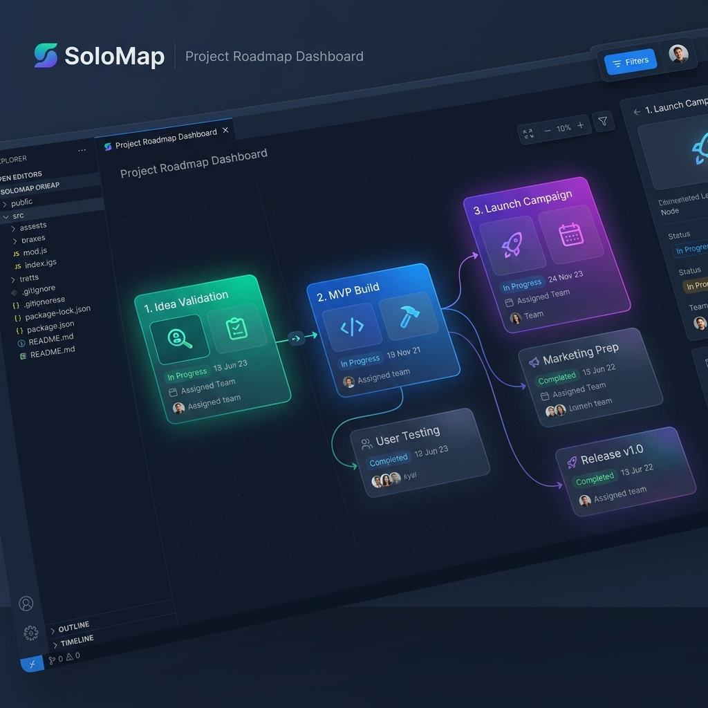
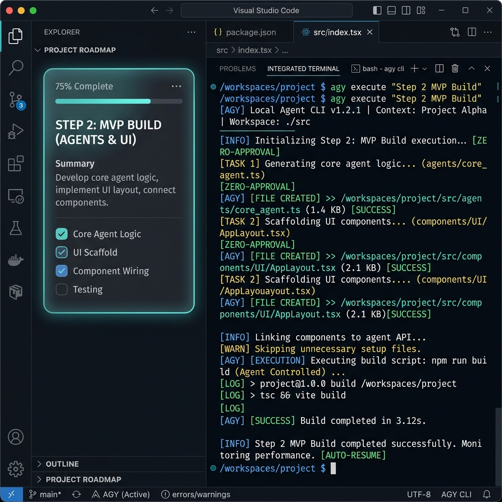
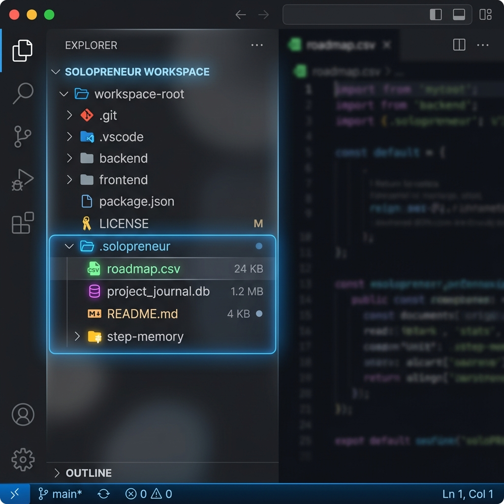

# SoloMap 小红书推广宣传文案

这份宣传文案和配图专为小红书（RED）社交平台定制，旨在吸引独立开发者、程序员与 AI 效率工具爱好者。所有相关图片均已保存在本项目的 `docs/` 目录中。

---

## 🎨 宣传配图展示 (Screenshots & Visual Assets)

本目录中已包含以下三张高保真暗色系（Dark Theme）宣传配图，您可以直接在发布小红书时上传：

### 📌 图 1：黄金封面图 (Visual Project Roadmap Cover)
展示 SoloMap 核心可视化看板，清晰的任务依赖节点，展现科技美感。
*   文件路径：[docs/assets/solomap_red_cover.png](../assets/solomap_red_cover.png)
*   预览：
    

### 📌 图 2：核心功能图 (Local Agent CLI Terminal Integration)
展示 VS Code 分屏下本地 Agent CLI (`agy`) 执行环节任务时的实时日志。
*   文件路径：[docs/assets/solomap_red_terminal.png](../assets/solomap_red_terminal.png)
*   预览：
    

### 📌 图 3：架构特色图 (Local-First Git-Friendly Storage)
展示位于项目根目录的 `.solopreneur/` 数据目录，包含 `roadmap.csv`、`project_journal.db` 等文件，彰显本地优先与 Git 友好特色。
*   文件路径：[docs/assets/solomap_red_local_first.png](../assets/solomap_red_local_first.png)
*   预览：
    

---

## ✍️ 小红书推文文案 (RED Promotion Copy)

> 💡 建议在发布小红书时直接复制以下文本。文案中已包含 emoji 表情符号、分段排版、痛点分析以及热门标签。

***

### 📌 标题选项（可根据个人喜好选择一个）：
1. 💻 独立开发爽飞！这个 VS Code 路线图插件真的太强了！
2. 🔥 拒绝云端锁死！用本地 AI Agent 闭环开发是一种什么体验？
3. 🚀 程序员副业神器！用 SoloMap 让 AI 帮你打工，全程自动推进！

***

### 📌 正文内容：

🤔 你是否也想做个自己的副业项目，却卡在了冗长的规划中？
😢 各种云端 AI 工具收费昂贵，又担心代码隐私泄露？
🤯 项目越写越乱，AI Agent 经常“断片”不记得上一步做了什么？

程序员同胞们！别再用凌乱的记事本和昂贵的黑盒云服务了！今天给大家安利一款**本地优先**、直接运行在 VS Code 里的全能副业利器 —— ✨ **SoloMap** ✨

这不仅是一个颜值逆天的可视化路线图看板，更是一个本地 AI Agent 任务编排引擎！

---

### 🌟 核心硬核功能，直击痛点：

#### 1️⃣ 可视化 AI 路线图看板 (Visual Canvas)
*   **别再盲目写代码！** 开启项目后，SoloMap 会自动为你生成结构化路线图。
*   支持随时向 AI 发起路线图微调（Revision），无论需求怎么改，看板线条丝滑更新！
*   所有节点进度、依赖关系一目了然，治好你的拖延症。

#### 2️⃣ 本地 Agent CLI 深度集成 (Local-First Orchestration)
*   完美支持 **Antigravity (`agy`)**、**Claude Code**、**Codex** 等主流本地 AI 工具。
*   **拒绝黑盒收费！** 所有的任务跑在你本地的集成终端中，零延迟、零代码泄漏风险。
*   支持单步骤附加要求，配合 Handoff 机制，Agent 工作前自动读取历史记忆，再也不会“断片”！

#### 3️⃣ 极简 Git 友好架构 (Git-Friendly)
*   项目数据全部存在本地根目录的 `.solopreneur/` 文件夹下。
*   格式为干净的 `roadmap.csv` 和轻量 SQLite 数据库，可随代码直接提交 Git！
*   换电脑、换 IDE？直接 Git Clone 即可瞬间恢复开发状态，不依赖任何第三方云端后端。

---

### 🛠 几步开启你的独立开发之旅：
1. 在 VS Code 插件市场搜索安装 `SZLK.solopreneur-roadmap`。
2. 打开 VS Code 命令面板，输入并运行 `SoloMap: Show AI Roadmap`。
3. 关联你的本地项目文件夹，初始化你的第一个 Starter Roadmap！
4. 展开节点，选择你的本地 Agent CLI，发布指令，看着它在终端中自动写完功能！

💡 无论是想开发一个 Landing Page，还是构建复杂的 Full-Stack 网站，SoloMap 都能帮你将想法落地成可执行、可追溯的闭环工作流。

独立开发者的时代已经到来，快去 VS Code 试试这款神器，开启你的 Solo 创造之旅吧！💪

---

### 🏷 标签直达：
#独立开发 #独立开发者 #VSCode插件 #AIAgent #AI编程 #程序员副业 #效率工具 #程序员的日常 #Antigravity #我的独立开发之路 #代码隐私 #GitHub
